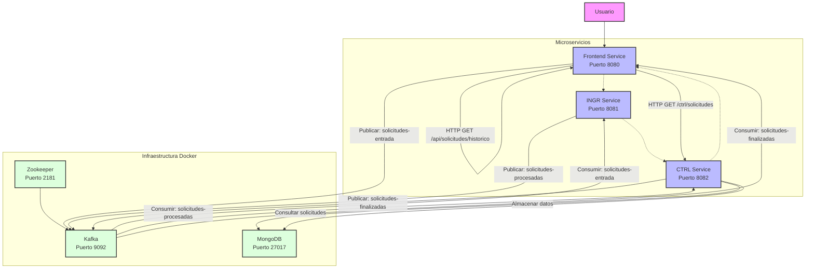
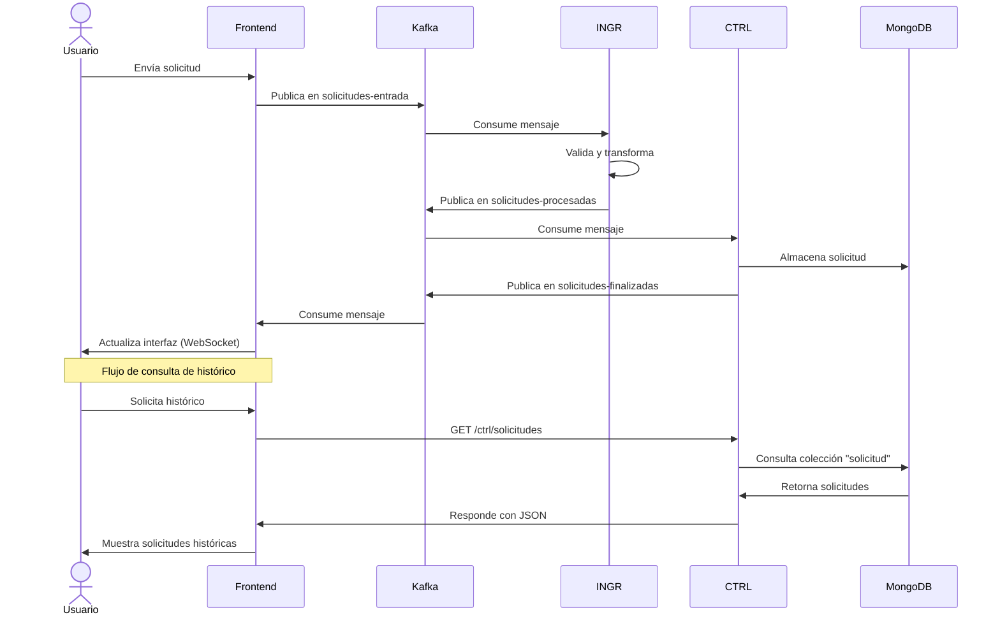
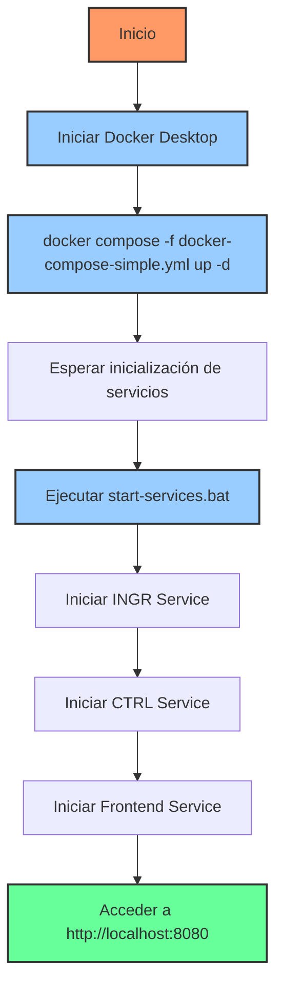
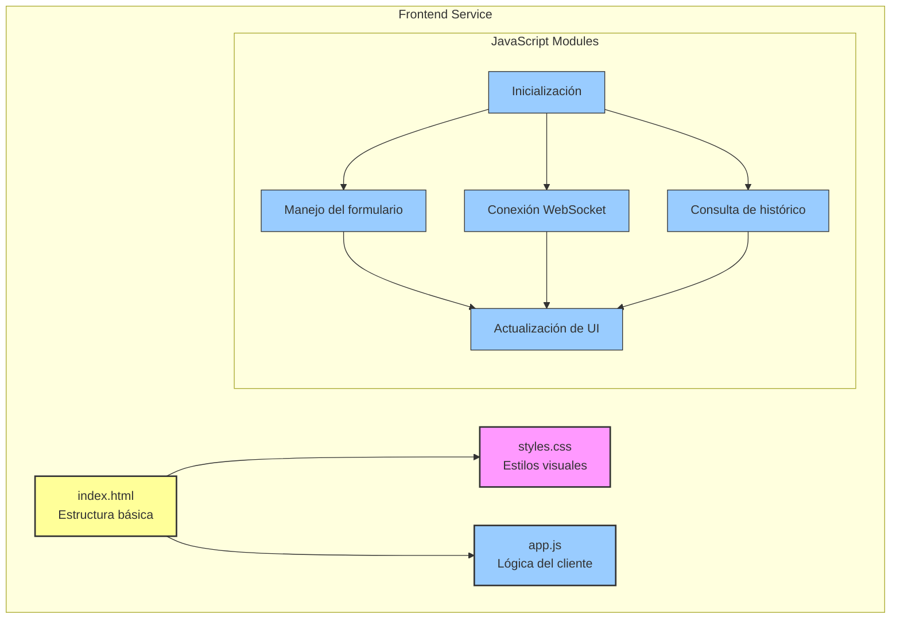

# Diagrama de Flujo de Ejecución

Este diagrama muestra el flujo de ejecución del sistema de procesamiento de solicitudes.

## Diagrama de Componentes y Comunicación

## Diagrama de Secuencia

## Flujo de Inicio del Sistema

## Estructura del Frontend

