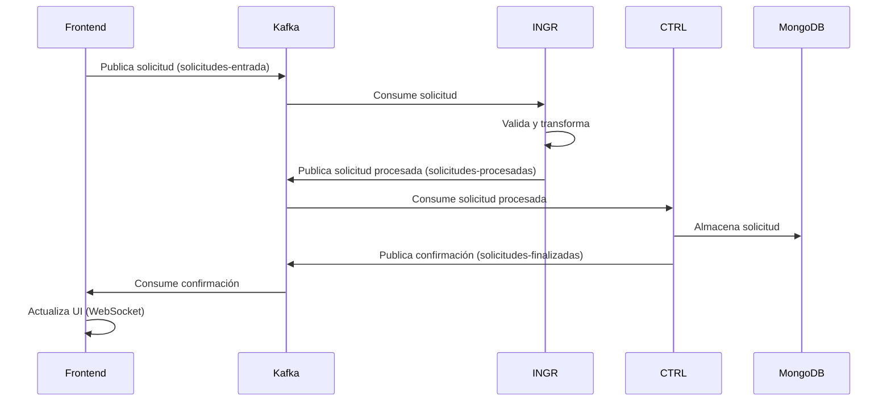

# Documentación de Microservicios

Este documento describe en detalle los microservicios que componen el sistema de gestión de solicitudes asíncrono.

## Módulo Common

### Descripción
Módulo compartido que contiene clases comunes, modelos de datos y utilidades que son utilizadas por todos los microservicios.

### Componentes Principales
- **Modelos de datos**: Definición de las entidades y DTOs utilizados en todo el sistema
- **Utilidades**: Funciones auxiliares compartidas

### Dependencias
- **jackson-databind**: Para la serialización/deserialización de objetos JSON
- **jackson-datatype-jsr310**: Para el manejo de tipos de datos de fecha y hora de Java 8+

### Ubicación
`./common/`

## Frontend Service

### Descripción
Microservicio que proporciona la interfaz de usuario y las APIs REST para que los usuarios puedan interactuar con el sistema. Implementa WebSockets para actualizaciones en tiempo real.

### Configuración
- **Puerto**: 8080
- **Contexto**: /
- **Logs**: `./frontend-service/logs/frontend.log`

### Endpoints REST
- `GET /api/solicitudes`: Obtiene todas las solicitudes
- `GET /api/solicitudes/{id}`: Obtiene una solicitud por su ID
- `POST /api/solicitudes`: Crea una nueva solicitud
- `DELETE /api/solicitudes/{id}`: Elimina una solicitud

### Configuración WebSocket
- **Endpoints**: /ws
- **Destinos**: /topic/solicitudes

### Interacción con Kafka
- **Consumer**: Consume mensajes del topic `solicitudes-finalizadas`
- **Producer**: Produce mensajes en el topic `solicitudes-entrada`

### Tecnologías
- Spring Boot
- Spring Web
- Spring WebSocket
- Spring Kafka
- Thymeleaf (templates HTML)
- Bootstrap (CSS)

### Ubicación
`./frontend-service/`

## INGR Service (Servicio de Ingestión)

### Descripción
Microservicio encargado de la validación y transformación de las solicitudes recibidas. Actúa como puente entre la entrada de datos y su procesamiento.

### Configuración
- **Puerto**: 8081
- **Contexto**: /ingr
- **Logs**: `./ingr-service/logs/ingr.log`

### Endpoints REST
- `GET /ingr/health`: Comprueba el estado del servicio
- `GET /ingr/stats`: Obtiene estadísticas del procesamiento

### Interacción con Kafka
- **Consumer**: Consume mensajes del topic `solicitudes-entrada`
- **Producer**: Produce mensajes en el topic `solicitudes-procesadas`

### Reglas de Validación
- Comprobación de campos obligatorios
- Validación de formato y contenido
- Transformación de datos

### Tecnologías
- Spring Boot
- Spring Kafka
- Validadores personalizados

### Ubicación
`./ingr-service/`

## CTRL Service (Servicio de Control)

### Descripción
Microservicio responsable del procesamiento final y almacenamiento de las solicitudes en MongoDB. Confirma el procesamiento mediante mensajes de Kafka.

### Configuración
- **Puerto**: 8082
- **Contexto**: /ctrl
- **Logs**: `./ctrl-service/logs/ctrl.log`

### Endpoints REST
- `GET /ctrl/health`: Comprueba el estado del servicio
- `GET /ctrl/solicitudes`: Acceso directo a las solicitudes almacenadas
- `GET /ctrl/stats`: Obtiene estadísticas del procesamiento

### Interacción con Kafka
- **Consumer**: Consume mensajes del topic `solicitudes-procesadas`
- **Producer**: Produce mensajes en el topic `solicitudes-finalizadas`

### Interacción con MongoDB
- **Base de datos**: solicitudes-db
- **Colección**: solicitudes
- **Operaciones**: Inserciones y consultas

### Tecnologías
- Spring Boot
- Spring Kafka
- Spring Data MongoDB
- MongoDB

### Ubicación
`./ctrl-service/`

## Flujo de Comunicación entre Microservicios

## Configuración de Puertos y Servicios

| Servicio         | Puerto | Descripción                          |
|------------------|--------|--------------------------------------|
| Frontend Service | 8080   | Interfaz de usuario y API REST       |
| INGR Service     | 8081   | Validación y transformación          |
| CTRL Service     | 8082   | Procesamiento y almacenamiento       |
| Kafka            | 9092   | Broker de mensajería                 |
| Zookeeper        | 2181   | Coordinación de Kafka                |
| MongoDB          | 27017  | Base de datos de almacenamiento      |

## Monitoreo y Observabilidad

Cada microservicio proporciona endpoints de monitoreo:

- `/actuator/health`: Estado de salud del servicio
- `/actuator/info`: Información sobre el servicio
- `/actuator/metrics`: Métricas del servicio

Para más detalles sobre el monitoreo del sistema completo, consulte [MANUAL_MONITOREO.md](MANUAL_MONITOREO.md). 