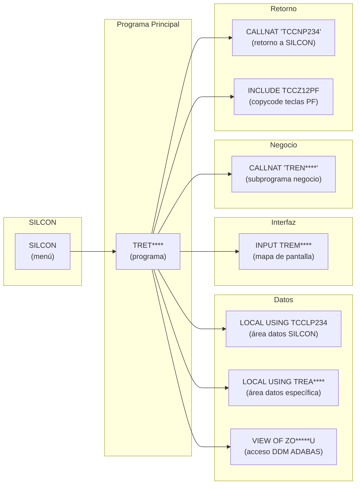
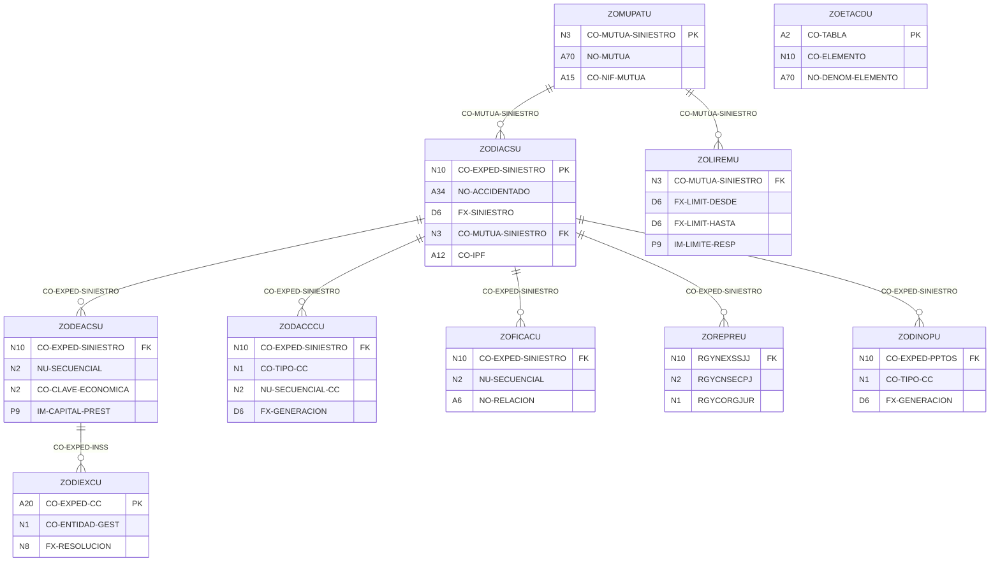
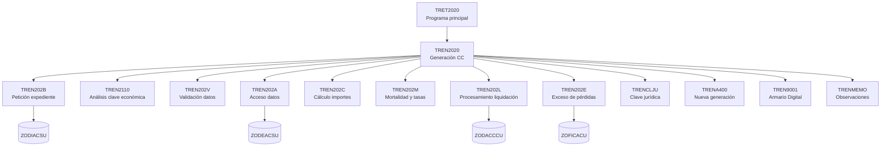
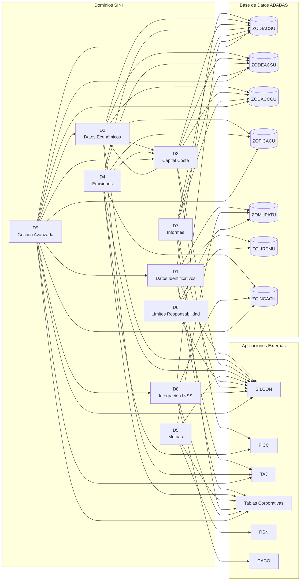

# Documentación de la Aplicación SINI

## Sistema de Gestión de Siniestros — TGSS

---

## Índice General

- [1. Introducción y Contexto](#1-introducción-y-contexto)
- [2. Arquitectura Técnica](#2-arquitectura-técnica)
- [3. Modelo de Datos](#3-modelo-de-datos)
- [4. Dominio 1 — Datos Identificativos de Expedientes](#4-dominio-1--datos-identificativos-de-expedientes)
- [5. Dominio 2 — Datos Económicos](#5-dominio-2--datos-económicos)
- [6. Dominio 3 — Capital Coste](#6-dominio-3--capital-coste)
- [7. Dominio 4 — Emisiones y Notificaciones](#7-dominio-4--emisiones-y-notificaciones)
- [8. Dominio 5 — Mutuas y Compañías Aseguradoras](#8-dominio-5--mutuas-y-compañías-aseguradoras)
- [9. Dominio 6 — Límites de Responsabilidad](#9-dominio-6--límites-de-responsabilidad)
- [10. Dominio 7 — Informes y Estadísticas](#10-dominio-7--informes-y-estadísticas)
- [11. Dominio 8 — Integración con INSS](#11-dominio-8--integración-con-inss)
- [12. Dominio 9 — Gestión Avanzada de Expedientes](#12-dominio-9--gestión-avanzada-de-expedientes)
- [13. Mapa de Dependencias Global](#13-mapa-de-dependencias-global)
- [14. Matriz de Trazabilidad](#14-matriz-de-trazabilidad)
- [15. Programas Batch (TBSINIET)](#15-programas-batch-tbsiniet)
- [16. Sugerencias y Observaciones](#16-sugerencias-y-observaciones)

---

## 1. Introducción y Contexto

### 1.1 Propósito

**SINI** (Siniestros) es una aplicación desarrollada en **Natural/ADABAS** por el área de **Aplicaciones Económicas y de Gestión Interna (A.E.G.I.)** de la **Gerencia de Informática de la Seguridad Social (GISS)**, perteneciente a la **Tesorería General de la Seguridad Social (TGSS)**.

Su función principal es la **gestión integral del ciclo de vida de los expedientes de siniestros laborales** (accidentes de trabajo y enfermedades profesionales). SINI orquesta las siguientes operaciones:

1. **Alta y mantenimiento** de datos identificativos de accidentados y expedientes.
2. **Gestión económica** de movimientos asociados a cada expediente (prestaciones, capitales).
3. **Cálculo actuarial** de capitales coste por invalidez y muerte, con generación de notas y propuestas de liquidación.
4. **Emisión** provisional y definitiva de certificaciones, propuestas de pago y notificaciones.
5. **Gestión de mutuas** patronales y compañías aseguradoras, incluyendo límites de responsabilidad.
6. **Generación de informes** presupuestarios, estadísticos, de duplicados y de control.
7. **Integración con el INSS** para consulta y carga de expedientes del Instituto Nacional de la Seguridad Social.
8. **Gestión documental** mediante Armario Digital (A.D.) para expedientes.

### 1.2 Ámbito Funcional

SINI contempla **92 procesos online**, organizados en **9 dominios funcionales**. La siguiente tabla recoge todos los procesos registrados:

| Código | Proceso | Dominio |
|--------|---------|---------|
| `TRE00` | Alta datos identificativos | Datos Identificativos |
| `TRE01` | Alta especial de datos identificativos | Datos Identificativos |
| `TRE02` | Modificación datos identificativos | Datos Identificativos |
| `TRE03` | Visualización datos identificativos | Datos Identificativos |
| `TRE04` | Baja datos identificativos | Datos Identificativos |
| `TRE05` | Actualización responsabilidad desconocida | Datos Identificativos |
| `TRE06` | Consulta alfabética | Datos Identificativos |
| `TRE07` | Consulta por nº de afiliación | Datos Identificativos |
| `TRE08` | Consulta por IPF | Datos Identificativos |
| `TRE12` | Estadísticas por periodo | Informes y Estadísticas |
| `TRE13` | Notas y PL de capital coste | Capital Coste |
| `TRE14` | Reimpresión de notas y PL | Capital Coste |
| `TRE15` | Visualización de datos económicos | Datos Económicos |
| `TRE16` | Alta de datos económicos | Datos Económicos |
| `TRE17` | Baja de datos económicos | Datos Económicos |
| `TRE19` | Modificación de datos económicos | Datos Económicos |
| `TRE20` | Alta especial de datos económicos | Datos Económicos |
| `TRE23` | Modificación tramos datos económicos | Datos Económicos |
| `TRE24` | Visualización de datos económicos | Datos Económicos |
| `TRE25` | Alta de datos económicos | Datos Económicos |
| `TRE26` | Baja de datos económicos | Datos Económicos |
| `TRE30` | Generación de capital coste | Capital Coste |
| `TRE31` | Emisión provisional | Emisiones |
| `TRE32` | Emisión definitiva | Emisiones |
| `TRE33` | Generación de informes | Emisiones |
| `TRE34` | Incorporación de fecha de liquidación | Emisiones |
| `TRE35` | Actualización y consulta | Emisiones |
| `TRE36` | Informe del presupuesto | Emisiones |
| `TRE37` | Estadística presupuestaria (OK's) | Emisiones |
| `TRE38` | Estadística presupuestaria (fechas) | Emisiones |
| `TRE39` | Consulta de expedientes de un colectivo | Informes y Estadísticas |
| `TRE40` | Consulta datos económicos de un colectivo | Informes y Estadísticas |
| `TRE41` | Inf. duplicados: fec. siniestro / mutua / nombre | Informes y Estadísticas |
| `TRE42` | Inf. duplicados: f. siniestro / mutua / f. nacimiento | Informes y Estadísticas |
| `TRE43` | Inf. duplicados: fec. siniestro / mutua / IPF-NAF | Informes y Estadísticas |
| `TRE44` | Inf. expedientes por número | Informes y Estadísticas |
| `TRE45` | Inf. expedientes por fecha de tratamiento | Informes y Estadísticas |
| `TRE46` | Inf. expedientes por fecha de inicio | Informes y Estadísticas |
| `TRE47` | Inf. expedientes por colectivo | Informes y Estadísticas |
| `TRE50` | Alta de mutuas y compañías aseguradoras | Mutuas |
| `TRE51` | Modificación de mutuas y compañías aseguradoras | Mutuas |
| `TRE52` | Visualización de mutuas y compañías aseguradoras | Mutuas |
| `TRE53` | Consulta general mutuas y cías. aseguradoras | Mutuas |
| `TRE54` | Informe impreso (RE7) | Mutuas |
| `TRE55` | Informe de expedientes de mutuas absorbidas | Mutuas |
| `TRE56` | Alta límite responsabilidad | Límites de Responsabilidad |
| `TRE57` | Modificación límite responsabilidad | Límites de Responsabilidad |
| `TRE58` | Visualización límite responsabilidad | Límites de Responsabilidad |
| `TRE59` | Baja límite responsabilidad | Límites de Responsabilidad |
| `TRE60` | Consulta | Límites de Responsabilidad |
| `TRE61` | Informe de límites de responsabilidad | Límites de Responsabilidad |
| `TRE62` | Tablas de capital coste | Capital Coste |
| `TRE63` | Tablas de capital coste informe impreso | Capital Coste |
| `TRE64` | Mantenimiento especial de datos identificativos | Datos Identificativos |
| `TRE65` | Mantenimiento de datos económicos | Datos Económicos |
| `TRE66` | Mantenimiento RERECC0U. Datos comunes | Gestión Avanzada |
| `TRE67` | Consulta datos BD INSS por expediente | Integración INSS |
| `TRE68` | Consulta datos BD INSS por IPF causante | Integración INSS |
| `TRE69` | Consulta datos BD INSS por IPF beneficiario | Integración INSS |
| `TRE70` | Consulta datos BD INSS por certificación | Integración INSS |
| `TRE75` | Emisión de impugnaciones | Emisiones |
| `TRE81` | Informe de P.R. | Informes y Estadísticas |
| `TRE82` | Consulta de ficheros del INSS cargados | Integración INSS |
| `TRE85` | Recuperación fecha de emisión | Emisiones |
| `TRE87` | Informe de pendientes del fichero del INSS | Integración INSS |
| `TRE88` | Inf. situación de registros del INSS y manuales | Integración INSS |
| `TRE89` | Modificación de observaciones | Datos Identificativos |
| `TRE90` | Emisión propuestas pago individualizadas | Emisiones |
| `TRE91` | Gestión de expedientes | Gestión Avanzada |
| `TRE92` | Expedientes sin PR | Informes y Estadísticas |
| `TRE93` | Inf. historial de expedientes A.T. | Informes y Estadísticas |
| `TRE94` | Alta de registro A.D. | Gestión Avanzada |
| `TRE95` | Información actualizaciones de un P.R. | Datos Económicos |
| `TRE96` | Simulaciones de capital coste | Capital Coste |
| `TRE97` | Fichero presupuesto gasto | Informes y Estadísticas |
| `TRE98` | Consulta de tablas | Gestión Avanzada |
| `TREA0` | Cambio de responsabilidad | Datos Económicos |
| `TREA1` | Actualización ind. e importes gran invalidez | Gestión Avanzada |
| `TREA2` | Actualización ind. de diferencias de pensión | Gestión Avanzada |
| `TREA4` | Nueva generación de capital coste | Capital Coste |
| `TREA5` | Consulta por expediente de siniestros | Integración INSS |
| `TREA6` | Informe de correos | Informes y Estadísticas |
| `TREA7` | Fecha de emisión cálculo tipo III | Emisiones |
| `TREA9` | Modificar registro A.D. | Gestión Avanzada |
| `TREAB` | Actualización porcentaje de responsabilidad | Gestión Avanzada |
| `TREB4` | Estadísticas del armario digital | Informes y Estadísticas |
| `TREB5` | Asignación de expedientes a un colectivo | Gestión Avanzada |
| `TREB6` | Reintegros de expedientes colectivos | Gestión Avanzada |
| `TREB7` | Generación doc. anulación y corrección | Emisiones |
| `TREB8` | Emisión de notificaciones de reintegro | Emisiones |
| `TREB9` | Consulta importe INSS | Integración INSS |

> **Nota:** El proceso `TREB9` (programa `TRETB900`) no figura en el listado oficial de `leeme.txt`, pero el programa existe en el código fuente y su cabecera confirma la función "Consulta importe INSS".
>
> En `leeme.txt`, el código `TREB4` aparece duplicado con dos descripciones: "Estadísticas del armario digital" y "Fecha de emisión". En el código fuente solo existe `TRETB400` con función "Estadísticas del armario digital".

### 1.3 Ecosistema de Aplicaciones

SINI forma parte de un ecosistema de aplicaciones interrelacionadas, tal como se documenta en las cabeceras de los módulos:

| Aplicación | Descripción | Ruta documental |
|------------|-------------|-----------------|
| **SINI** | Gestión de Siniestros (esta aplicación) | `I:\CDESARROLLO\AEGI\Aplicaciones\046 SINI Siniestros` |
| **FICC** | Fichas de Capital Coste — Gestión de procesos recaudatorios | `I:\CDESARROLLO\AEGI\Aplicaciones\048 FICC Capitales coste` |
| **LIMU** | Liquidación de Mutuas | `I:\CDESARROLLO\AEGI\Aplicaciones\066 LIMU Liquidación mutuas` |
| **REDP** | Reaseguro y Exceso de Pérdidas | `I:\CDESARROLLO\AEGI\Aplicaciones\047 REDP Reaseguro exceso pérdidas` |
| **CCEE** | Capitales Coste de Responsabilidad Empresarial | `I:\CDESARROLLO\AEGI\Aplicaciones\141 CCEE` |

La documentación de peticiones GEDEON se encuentra en `I:\CDESARROLLO\AEGI\Peticiones\Finalizadas`.

### 1.4 Glosario de Términos

| Término | Descripción |
|---------|-------------|
| **ADABAS** | Adaptive Database System. Base de datos utilizada por las aplicaciones Natural en mainframe. |
| **CALLNAT** | Instrucción Natural para invocar un subprograma externo. Equivalente a una llamada a función/método. |
| **Capital Coste** | Importe actuarial que la mutua debe ingresar en la TGSS para hacer frente a prestaciones derivadas de un siniestro. |
| **CCEE** | Capitales Coste de Responsabilidad Empresarial. Aplicación del ecosistema SINI. |
| **Clave Económica** | Código numérico de 2 dígitos que identifica el tipo de movimiento económico asociado a un expediente. |
| **Copycode** | Fragmento de código Natural reutilizable, incluido mediante la directiva `INCLUDE`. Extensión `.NSC`. |
| **DDM** | Data Definition Module. Describe la estructura lógica de un fichero ADABAS (equivalente a un esquema de tabla). |
| **Expediente** | Registro principal de un siniestro laboral, identificado por un código numérico de 10 dígitos (`CO-EXPED-SINIESTRO`). |
| **FICC** | Fichas de Capital Coste. Aplicación externa que gestiona procesos recaudatorios asociados a capitales coste. |
| **GEDEON** | Sistema de gestión de peticiones de desarrollo utilizado por la GISS para el seguimiento de cambios. |
| **GISS** | Gerencia de Informática de la Seguridad Social. Organismo responsable de los sistemas informáticos de la Seguridad Social. |
| **GI** | Gran Invalidez. Grado máximo de incapacidad permanente que puede derivar de un siniestro laboral. |
| **Helproutine** | Módulo Natural de ayuda contextual invocable desde pantallas. Extensión `.NSH`. |
| **INCLUDE** | Directiva Natural que inserta el contenido de un copycode en el punto de la directiva. |
| **INSS** | Instituto Nacional de la Seguridad Social. Entidad gestora con la que SINI intercambia datos de expedientes. |
| **IPF** | Identificador de Persona Física. Código de 12 caracteres utilizado para identificar personas en el sistema de la Seguridad Social. |
| **LDA** | Local Data Area. Estructura de datos local con constantes y variables de uso interno de un módulo. Extensión `.NSL`. |
| **LIMU** | Liquidación de Mutuas. Aplicación del ecosistema SINI. |
| **LOCAL USING** | Cláusula Natural que incluye una LDA o PDA en la sección `DEFINE DATA` de un módulo. |
| **Mapa** | Pantalla de terminal 3270 definida en Natural. Extensión `.NSM`. |
| **NAF** | Número de Afiliación a la Seguridad Social. Identificador numérico de 12 dígitos. |
| **Natural** | Lenguaje de programación de Software AG para desarrollo de aplicaciones en mainframe. |
| **OK** | Certificación de capital coste emitida oficialmente. |
| **PDA** | Parameter Data Area. Estructura de datos compartida entre módulos Natural como parámetros (equivalente a un DTO). Extensión `.NSA`. |
| **PL** | Propuesta de Liquidación. Documento generado junto con la nota de capital coste. |
| **P.R.** | Proceso Recaudatorio. Expediente de recaudación asociado a un capital coste en la aplicación FICC. |
| **REDP** | Reaseguro y Exceso de Pérdidas. Aplicación del ecosistema SINI. |
| **ROCHADE** | Identificador de aplicación origen utilizado en procesos de emisión de documentos (referenciado en `TREBEJAM` como campo `BAE1-ROCHADE`). |
| **SILCON** | Sistema de control de acceso a transacciones Natural. Gestiona menús y permisos. |
| **Subprograma** | Módulo Natural invocable mediante `CALLNAT`. Extensión `.NSN`. |
| **Superdescriptor** | Clave de acceso compuesta en ADABAS, formada por la concatenación de varios campos. Permite búsquedas eficientes por combinación de criterios. |
| **TGSS** | Tesorería General de la Seguridad Social. Organismo al que pertenece SINI. |
| **Tramo** | Subdivisión dentro de un dato económico, utilizada para desglosar importes por periodos o conceptos. |
| **UCM** | Unidad de Control de Mantenimiento. Campo de auditoría que registra usuario y fecha de última modificación. |
| **VIEW OF** | Cláusula Natural que define una vista parcial de una DDM, seleccionando únicamente los campos necesarios para un módulo. |

---

## 2. Arquitectura Técnica

### 2.1 Librerías Natural

La aplicación se organiza en **tres librerías Natural**, cada una con un propósito diferenciado:

| Librería | Tipo | NSP | NSN | NSM | NSH | NSA | NSL | NSC | NST | Total |
|----------|------|-----|-----|-----|-----|-----|-----|-----|-----|-------|
| **TOSINIET** | Online | 99 | 85 | 516 | 18 | 16 | 2 | 10 | 1 | 747 |
| **TBSINIET** | Batch | 581 | 35 | 152 | — | 4 | 22 | — | — | 794 |
| **SYSTEM** | DDMs | — | — | — | — | — | — | — | — | 298 |

**Tipos de módulo:**

| Extensión | Tipo | Descripción |
|-----------|------|-------------|
| `.NSP` | Programa | Módulo ejecutable directamente o invocable como programa principal de una transacción. |
| `.NSN` | Subprograma | Módulo invocable mediante `CALLNAT`. Recibe y devuelve parámetros. |
| `.NSM` | Mapa | Definición de pantalla de terminal 3270 (entrada/salida de datos). |
| `.NSH` | Helproutine | Módulo de ayuda contextual invocable desde campos de pantalla. |
| `.NSA` | PDA | Parameter Data Area. Estructura de datos para paso de parámetros entre módulos. |
| `.NSL` | LDA | Local Data Area. Estructura de datos local con constantes y variables. |
| `.NSC` | Copycode | Fragmento de código reutilizable incluido mediante `INCLUDE`. |
| `.NST` | Text | Texto de mensajes o constantes literales. |
| `.NSD` | DDM | Data Definition Module. Describe la estructura de un fichero ADABAS. |

> **Nota sobre dependencias externas:** El código fuente de SINI referencia mediante `CALLNAT` y `LOCAL USING` un total de 35 módulos cuyo fuente no se incluye en este extracto del código (pertenecen a librerías corporativas SILCON, FICC, TAJ, etc.). Estos módulos se documentan en la Sección 13 (Dependencias externas). Todos han sido verificados como referencias válidas presentes en el código fuente de SINI.

### 2.2 Base de Datos ADABAS

SINI utiliza los siguientes ficheros ADABAS principales (DB 046):

| DDM | Fichero | Descripción | Uso principal |
|-----|---------|-------------|---------------|
| **ZODIACSU** | 110 | Expediente de siniestro | Tabla central: datos identificativos del accidentado, fechas, mutua, situación, colectivo, IPF, NAF. |
| **ZODEACSU** | 111 | Datos económicos | Movimientos económicos por expediente: clave económica, importes, fechas, propuesta de pago, tramos de capital. |
| **ZODACCCU** | 117 | Capital coste | Cálculo actuarial: tipo CC (invalidez/muerte), salario, renta, mutua responsable, grupos de cálculo, beneficiarios. |
| **ZOFICACU** | 108 | Fichas de capital coste | Certificaciones emitidas: relación, fechas de entrada/emisión, expediente INSS, cargos, ingresos, reintegros. |
| **ZOMUPATU** | 037 | Mutuas patronales | Maestro de mutuas: nombre, dirección, NIF, cuenta bancaria, mutua absorbedora. |
| **ZOLIREMU** | 114 | Límites de responsabilidad | Importes límite por mutua y periodo: fecha desde/hasta, importe, cuota parte. |
| **ZOETACDU** | 030 | Tablas de codificación | Tablas paramétricas: código de tabla, elemento, denominación, información adicional. |
| **ZODIEXCU** | 031 | Expedientes INSS (CCEE) | Datos de expedientes del INSS: certificación, entidad gestora, resolución, sentencia, competencia. |
| **ZODINOPU** | 211 | Presupuestos | Expedientes de presupuesto de capital coste: tipo CC, fecha generación, tipo registro, IPF, NAF. |
| **ZOREPREU** | 189 | Recursos judiciales | Procedimientos judiciales asociados a expedientes: órgano judicial, sala, recurso, firmeza, resolución. |
| **ZORETRAU** | 074 | Regularización de trabajadores | Datos de regularización: provincia, periodo, días de alta CC/AT, empresa, trabajador. |

### 2.3 Convenciones de Nomenclatura

#### Procesos y programas

Cada proceso online se identifica por un código de 5 caracteres (p.ej. `TRE00`, `TREA1`). El programa principal asociado se obtiene mediante la siguiente regla:

> Se inserta una **T** en la cuarta posición del código y se añade **00** al final, formando un nombre de 8 caracteres.

| Código proceso | Programa principal | Ejemplo |
|----------------|-------------------|---------|
| `TRE00` | `TRET1010` | Alta datos identificativos |
| `TREA1` | `TRETA100` | Actualización ind. GI |
| `TREB7` | `TRETB700` | Doc. anulación y corrección |

#### Prefijos de módulos

| Prefijo | Tipo | Descripción |
|---------|------|-------------|
| `TRET*` | Programa principal | Programa online vinculado a una transacción SILCON. |
| `TREN*` | Subprograma | Subprograma de negocio invocado por los programas principales. |
| `TREM*` | Mapa | Pantalla de terminal 3270. |
| `TREH*` | Helproutine | Rutina de ayuda contextual. |
| `TREA*` | PDA / LDA | Área de datos (parámetros o local). |
| `TREC*` | Copycode | Código reutilizable incluido con `INCLUDE`. |
| `TREB*` | Programa batch | Programa de proceso por lotes (librería TBSINIET). |

#### Flujo típico de una transacción online

### 2.4 Integraciones Externas

SINI se integra con los siguientes sistemas y aplicaciones externas mediante llamadas `CALLNAT`:

| Sistema | Módulos Natural | Función |
|---------|----------------|---------|
| **SILCON** (Control de acceso) | `TCCNP234` (retorno menú), `TCCN1017`, `TCCN7002`, `TCCN7005`, `TCCLP234` (PDA) | Control de transacciones, menú principal, validación de acceso. |
| **FICC** (Fichas Capital Coste) | `TFCN2400`, `TFCN0007`, `TFCNC003`, `TFCNC004` | Gestión de procesos recaudatorios, emisión de fichas, firma actuarial. |
| **TAJ** (Tablas Auxiliares) | `TAJNC006`, `TAJNC009`, `TAJNC011`, `TAJN202U`, `TAJN202W` | Acceso a tablas auxiliares, validación de datos, armario digital. |
| **Tablas Corporativas** | `GP0PN003`, `GP0PN004`, `GP0PN011`, `GP0PN015` | Acceso a tablas corporativas: formato de fechas, provincias, validaciones. |
| **Batch Corporativo** | `TCCN8001`, `TCCN8B01` | Generación y envío de JCL para procesos batch. |
| **Validación IBAN** | `CVALIBAN` | Validación de cuentas bancarias IBAN. |
| **RSN** (Datos maestros) | `RSNN9001`, `RSNN9003` | Validación de datos maestros de mutuas. |
| **Utilidades** | `USR1068N`, `LOENCHAP`, `RXXN0020` | Utilidades diversas: impresión, encadenamiento, acceso a datos. |
| **PBPACACO** | `PBPNCACO` | Acceso a datos de la aplicación CACO (consulta importes). |

### 2.5 Diagrama de Arquitectura General

```mermaid
graph TB
    subgraph "Menú SILCON"
        SILCON_MENU["SILCON<br>Menú principal"]
    end

    subgraph "SINI — Librería Online (TOSINIET)"
        subgraph "Datos Identificativos"
            D1["TRET1010–1017<br>TRE00–TRE04, TRE64, TRE89"]
        end
        subgraph "Consultas"
            D1C["TRET1020, 1040, 104A<br>TRE06–TRE08"]
        end
        subgraph "Datos Económicos"
            D2["TRET2013–2135<br>TRE15–TRE26, TREA0"]
        end
        subgraph "Capital Coste"
            D3["TRET2020, 1085, 4301–4302<br>TRE13–14, TRE30, TRE62–63, TRE96"]
        end
        subgraph "Emisiones"
            D4["TRET2310–2354, 5000–5010<br>TRE31–38, TRE85, TRE90"]
        end
        subgraph "Mutuas"
            D5["TRET4101–4105<br>TRE50–TRE55"]
        end
        subgraph "Límites"
            D6["TRET4201–4206<br>TRE56–TRE61"]
        end
        subgraph "Informes"
            D7["TRET3010–3091, 8000<br>TRE41–47, TRE81, TRE92–93"]
        end
        subgraph "INSS"
            D8["TRET6002–6015, 8800<br>TRE67–70, TRE82, TRE87–88"]
        end
        subgraph "Gestión Avanzada"
            D9["TRET9100–9800, TRETA*–TRETB*<br>TRE91–98, TREA1–TREB6"]
        end
    end

    subgraph "SINI — Librería Batch (TBSINIET)"
        BATCH["581 programas batch<br>Informes, estadísticas,<br>procesos masivos"]
    end

    subgraph "Base de Datos ADABAS (DB 046)"
        ZODIACSU[(ZODIACSU<br>Expedientes)]
        ZODEACSU[(ZODEACSU<br>D. Económicos)]
        ZODACCCU[(ZODACCCU<br>Capital Coste)]
        ZOFICACU[(ZOFICACU<br>Fichas CC)]
        ZOMUPATU[(ZOMUPATU<br>Mutuas)]
        ZOLIREMU[(ZOLIREMU<br>Límites)]
        ZOETACDU[(ZOETACDU<br>Tablas)]
        ZODIEXCU[(ZODIEXCU<br>INSS)]
    end

    subgraph "Aplicaciones Externas"
        FICC["FICC<br>Fichas Capital Coste"]
        TAJ["TAJ<br>Tablas Auxiliares"]
        SILCON["SILCON<br>Control Acceso"]
        GP0P["GP0P*<br>Tablas Corporativas"]
    end

    SILCON_MENU --> D1 & D1C & D2 & D3 & D4 & D5 & D6 & D7 & D8 & D9
    D1 & D1C --> ZODIACSU
    D2 --> ZODEACSU
    D3 --> ZODACCCU
    D4 --> ZOFICACU
    D5 --> ZOMUPATU
    D6 --> ZOLIREMU
    D7 --> ZODIACSU & ZODEACSU & ZODACCCU
    D8 --> ZODIEXCU
    D9 --> ZODIACSU & ZODEACSU & ZODACCCU

    D1 & D2 & D3 & D4 & D5 & D9 --> SILCON
    D3 & D4 --> FICC
    D9 --> TAJ
    D4 & D5 --> GP0P

    BATCH --> ZODIACSU & ZODEACSU & ZODACCCU & ZOFICACU
```

---

## 3. Modelo de Datos

### 3.1 DDMs Principales — Campos clave

#### ZODIACSU — Expediente de siniestro (fichero 110)

| Campo | Tipo | Descripción |
|-------|------|-------------|
| `CO-EXPED-SINIESTRO` | N10 (D) | Código de expediente de siniestro. Clave principal. |
| `NO-ACCIDENTADO` | A34 | Nombre del accidentado. |
| `FX-INICIO-EXP` | D6 | Fecha de inicio del expediente. |
| `FX-ACTUALIZACION` | D6 | Fecha de última actualización. |
| `FX-SINIESTRO` | D6 | Fecha del siniestro. |
| `CO-SITUACION` | N1 | Código de situación del expediente. |
| `CO-MUTUA-SINIESTRO` | N3 (D) | Código de mutua responsable. Descriptor. |
| `IM-LIMITE-RES` | P9 | Importe del límite de responsabilidad. |
| `CO-COLECTIVO` (grupo) | — | Grupo: número de colectivo (N3) + fecha colectivo (N4). |
| `CO-IPF` | A12 (D) | Código de Identificador de Persona Física. Descriptor. |
| `CO-EXPED-ANTERIOR` | N10 (D) | Código de expediente anterior (encadenamiento). |
| `GR-INFO` (grupo periódico) | — | Grupo de auditoría: transacción, informe, módulo, usuario, fecha, descripción, opción (50 ocurrencias). |

#### ZODEACSU — Datos económicos (fichero 111)

| Campo | Tipo | Descripción |
|-------|------|-------------|
| `CO-EXPED-SINIESTRO` | N10 (D) | Código de expediente. Clave. |
| `NU-SECUENCIAL` | N2 | Número secuencial del movimiento económico. |
| `CO-CLAVE-ECONOMICA` | N2 | Código de clave económica (tipo de movimiento). |
| `IM-CAPITAL-PREST` | P9 | Importe de capital/prestación. |
| `CO-PROP-PAGO` | N8 (D) | Código de propuesta de pago. Descriptor. |
| `FX-GRABACION` | D6 (D) | Fecha de grabación. Descriptor. |
| `IM-EXCESO-PERDIDAS` | P9 | Importe de exceso de pérdidas. |
| `FX-EFECTO` | D6 | Fecha de efecto. |
| `CO-EXPED-INSS` (grupo) | — | Grupo: número expediente INSS (N5) + fecha (N4). |
| `IM-SALARIO` | P9 | Remuneración anual base. |

#### ZODACCCU — Capital coste (fichero 117)

| Campo | Tipo | Descripción |
|-------|------|-------------|
| `CO-TIPO-CC` | N1 | Tipo de capital coste: 1=Invalidez, 2=Muerte. |
| `CO-EXPED-SINIESTRO` | N10 | Código de expediente. |
| `NU-SECUENCIAL-CC` | N2 | Número secuencial del cálculo. |
| `FX-GENERACION` | D6 (D) | Fecha de generación. Descriptor. |
| `CO-TIPO-INVALIDEZ` | N1 | Tipo de invalidez. |
| `NO-ACCIDENTADO` | A34 | Nombre del accidentado. |
| `FX-SINIESTRO` | D6 | Fecha del siniestro. |
| `IM-SALARIO` | P9 | Salario base de cálculo. |
| `CO-MUTUA-SINIESTRO` | N3 | Código de mutua responsable. |
| `IM-LIMITE-RES` | P9 | Importe del límite de responsabilidad. |

#### ZOMUPATU — Mutuas patronales (fichero 037)

| Campo | Tipo | Descripción |
|-------|------|-------------|
| `CO-MUTUA-SINIESTRO` | N3 (D) | Código de mutua. Clave principal. |
| `NO-MUTUA` | A70 | Nombre de la mutua. |
| `NO-DIRECCION` | A32 | Dirección postal. |
| `NO-LOCALIDAD` | A30 | Localidad. |
| `CO-POSTAL` | N5 | Código postal. |
| `CO-NIF-MUTUA` | A15 | NIF de la mutua. |
| `GR-ENT-CCL` (grupo) | — | Cuenta bancaria: entidad financiera (N4), agencia (N4), cuenta (A25). |

#### ZOLIREMU — Límites de responsabilidad (fichero 114)

| Campo | Tipo | Descripción |
|-------|------|-------------|
| `CO-MUTUA-SINIESTRO` | N3 | Código de mutua. |
| `FX-LIMIT-DESDE` | D6 | Fecha de inicio del periodo de vigencia. |
| `FX-LIMIT-HASTA` | D6 | Fecha de fin del periodo de vigencia. |
| `IM-LIMITE-RESP` | P9 | Importe del límite de responsabilidad. |
| `PO-CUOTA-PARTE` | N2 | Porcentaje de cuota parte. |
| `CL-SP1` | B7 (S) | Superdescriptor: `CO-MUTUA-SINIESTRO` + `FX-LIMIT-HASTA`. |

#### ZOETACDU — Tablas de codificación (fichero 030)

| Campo | Tipo | Descripción |
|-------|------|-------------|
| `CO-TABLA` | A2 | Código de tabla. |
| `CO-ELEMENTO` | N10 | Código del elemento dentro de la tabla. |
| `NO-DENOM-ELEMENTO` | A70 | Descripción del elemento. |
| `GR-ADICIONAL` (grupo periódico) | — | Información adicional por elemento (A60, múltiples ocurrencias). |

### 3.2 Diagrama de Relaciones entre DDMs

### 3.3 Superdescriptores y claves de acceso

Los superdescriptores combinan campos para formar claves de búsqueda eficientes:

| DDM | Superdescriptor | Campos fuente | Uso |
|-----|----------------|---------------|-----|
| **ZODIACSU** | Implícito por `CO-EXPED-SINIESTRO` | `CO-EXPED-SINIESTRO` (N10) | Acceso directo por expediente. |
| **ZODIACSU** | Implícito por `CO-MUTUA-SINIESTRO` | `CO-MUTUA-SINIESTRO` (N3) | Consulta de expedientes por mutua. |
| **ZODIACSU** | Implícito por `CO-IPF` | `CO-IPF` (A12) | Consulta por identificador de persona física. |
| **ZODEACSU** | Implícito por `CO-EXPED-SINIESTRO` | `CO-EXPED-SINIESTRO` (N10) | Acceso a datos económicos por expediente. |
| **ZODEACSU** | Implícito por `CO-PROP-PAGO` | `CO-PROP-PAGO` (N8) | Acceso por propuesta de pago. |
| **ZOLIREMU** | `CL-SP1` | `CO-MUTUA-SINIESTRO`(1-3) + `FX-LIMIT-HASTA`(1-4) | Consulta de límites por mutua y fecha. |
| **ZODACCCU** | Implícito por `FX-GENERACION` | `FX-GENERACION` (D6) | Consulta de capitales por fecha de generación. |
| **ZOFICACU** | Implícito por `CO-EXPED-SINIESTRO` | `CO-EXPED-SINIESTRO` (N10) | Acceso a fichas por expediente. |

---

## 4. Dominio 1 — Datos Identificativos de Expedientes

- [4.1 Descripción funcional](#41-descripción-funcional)
- [4.2 Procesos y programas](#42-procesos-y-programas)
- [4.3 Inventario completo de módulos](#43-inventario-completo-de-módulos)
- [4.4 Flujo funcional](#44-flujo-funcional)
- [4.5 Mapa de dependencias](#45-mapa-de-dependencias)
- [4.6 Diagrama de dependencias](#46-diagrama-de-dependencias)

### 4.1 Descripción funcional

Este dominio gestiona el **ciclo de vida de los datos identificativos** de los expedientes de siniestros laborales. Comprende las operaciones de alta, alta especial (para accidentados con datos incompletos), modificación, visualización, baja y consulta de expedientes. Cada expediente se identifica por un código numérico de 10 dígitos (`CO-EXPED-SINIESTRO`) almacenado en la DDM **ZODIACSU** y contiene información del accidentado (nombre, IPF, NAF), fechas (siniestro, inicio, actualización), mutua responsable, situación, colectivo y observaciones.

Las consultas se realizan por tres criterios: **alfabético** (nombre del accidentado), **NAF** (número de afiliación) e **IPF** (identificador de persona física).

### 4.2 Procesos y programas

| Proceso | Programa | Función |
|---------|----------|---------|
| `TRE00` | `TRET1010` | Alta de expedientes. Delega en `TREN101B`. |
| `TRE01` | `TRET1011` | Alta especial de datos identificativos (accidentados con datos incompletos). |
| `TRE02` | `TRET1013` | Modificación de datos identificativos. |
| `TRE03` | `TRET1014` | Visualización de datos identificativos. |
| `TRE04` | `TRET1015` | Baja de datos identificativos. |
| `TRE05` | `TRET1012` | Actualización de responsabilidad desconocida. |
| `TRE06` | `TRET1020` | Consulta alfabética de expedientes. |
| `TRE07` | `TRET1040` | Consulta general de expedientes por NAF. |
| `TRE08` | `TRET104A` | Consulta general de expedientes por IPF. |
| `TRE64` | `TRET1016` | Alta sin restricciones de datos identificativos (mantenimiento especial). |
| `TRE89` | `TRET1017` | Modificación del campo observaciones. |

### 4.3 Inventario completo de módulos

#### 4.3.1 Programas principales (TRET*)

| Módulo | Función | LOCAL USING | CALLNAT | VIEW OF |
|--------|---------|-------------|---------|---------|
| `TRET1010` | Alta de expedientes (TRE00) | `TCCLP234` | `TREN101B`, `TCCNP234` | — |
| `TRET1011` | Alta especial datos identificativos | `TCCLP234`, `CGTLPN02`, `CGTLPN03`, `TREAAJ16`, `TAJAC011`, `TREACZ05` | `RXXN0020`, `TAJNC011`, `TCCN1017`, `TCCN7005`, `TCCNP234`, `TREN1011`, `TRENAJ16`, `TRENCZ05`, `TRENMEMO`, `TRENOBSV`, `TRENUCM3` | `ZODIACSU`, `ZOETACDU`, `ZOLIREMU`, `ZOMUPATU` |
| `TRET1012` | Actualización responsabilidad desconocida | `TCCLP234` | `TCCNP234` | `ZODIACSU`, `ZODEACSU` |
| `TRET1013` | Modificación datos identificativos | `TCCLP234`, `CGTLPN02`, `CGTLPN03`, `TREAAJ16`, `TAJAC011`, `TREACZ05` | `GP0PN003`, `RXXN0020`, `TAJNC011`, `TCCN1017`, `TCCN7005`, `TCCNP234`, `TRENAJ16`, `TRENCZ05`, `TRENMEM1`, `TRENMEMO`, `TRENUCM2`, `TRENUCM3` | `ZODIACSU`, `ZODEACSU`, `ZOETACDU`, `ZOFICACU`, `ZOLIREMU`, `ZOMUPATU` |
| `TRET1014` | Visualización datos identificativos | `TCCLP234`, `CGTLPN02`, `CGTLPN03` | `GP0PN003`, `RXXN0020`, `TCCNP234`, `TRENC009`, `TRENMEM1`, `TRENMEMO` | `ZODIACSU`, `ZOETACDU` |
| `TRET1015` | Baja datos identificativos | `TCCLP234`, `CGTLPN02`, `CGTLPN03`, `TAJAC011` | `GP0PN003`, `RXXN0020`, `TAJNC011`, `TCCNP234`, `TRENMEM1`, `TRENMEMO`, `TRENUCM1` | `ZODIACSU`, `ZODACCCU`, `ZODCCACU`, `ZODEACSU`, `ZOETACDU`, `ZOINCACU` |
| `TRET1016` | Alta sin restricciones (TRE64) | `TCCLP234`, `CGTLPN02`, `TREAC010`, `TAJAC009`, `TAJAC011`, `TREAAJ12`, `TREAAJ16` | `TAJNC009`, `TAJNC011`, `TCCN1017`, `TCCN7005`, `TCCNP234`, `TREN1011`, `TRENAJ12`, `TRENAJ16`, `TRENC010`, `TRENMEMO`, `TRENTIP5`, `TRENUCM3` | `ZODIACSU`, `ZOETACDU`, `ZOLIREMU`, `ZOMUPATU` |
| `TRET1017` | Modificación observaciones (TRE89) | `TCCLP234`, `CGTLPN02`, `CGTLPN03` | `GP0PN003`, `RXXN0020`, `TCCNP234`, `TRENMEMO` | `ZODIACSU`, `ZOETACDU` |
| `TRET1020` | Consulta alfabética (TRE06) | — | `TREN1021`, `TREN1022`, `TRENP001` | `ZODIACSU` |
| `TRET1040` | Consulta por NAF (TRE07) | `TCCLP234` | `TCCNP234`, `TREN1021`, `TREN1022` | `ZODIACSU` |
| `TRET104A` | Consulta por IPF (TRE08) | `TCCLP234` | `TCCNP234`, `TREN104A` | — |

#### 4.3.2 Subprogramas (TREN*)

| Módulo | Función | Invocado por |
|--------|---------|-------------|
| `TREN101A` | Validación de tipo IPF/NAF, formato IPF y NAF. Retorna códigos de error 01–06. | `TRET1011`, `TRET1013`, `TRET1016` |
| `TREN101B` | Alta de datos identificativos. Subprograma principal de alta delegado por `TRET1010`. | `TRET1010` |
| `TREN1011` | Alta especial: lógica de grabación de datos de accidentados con información incompleta. | `TRET1011`, `TRET1016` |
| `TREN1021` | Visualización de expedientes que cumplen criterio de búsqueda (lista). | `TRET1020`, `TRET1040`, `TRET1090`, `TRETB500` |
| `TREN1022` | Visualización de expedientes que cumplen criterio de búsqueda (detalle). | `TRET1020`, `TRET1040`, `TRET1090`, `TRETB500` |
| `TREN104A` | Consulta general de expedientes por IPF. | `TRET104A` |
| `TREN1017` | Modificación del campo observaciones (lógica de negocio). | — |
| `TRENAJ16` | Validación y tratamiento de datos auxiliares TAJ (16 campos). | `TRET1011`, `TRET1013`, `TRET1016`, `TRETREID` |
| `TRENCZ05` | Tratamiento de datos para comunicación IIAH (10 mutuas compartidas). | `TRET1011`, `TRET1013` |
| `TRENMEMO` | Mantenimiento de información adicional (campo MEMO/observaciones). | `TRET1011`, `TRET1013`, `TRET1014`, `TRET1015`, `TRET1016`, `TRET1017`, `TRETREID` |
| `TRENMEM1` | Mantenimiento de información adicional (variante 1). | `TRET1013`, `TRET1014`, `TRET1015`, `TRETREID` |
| `TRENOBSV` | Rutina de solicitud de observaciones. | `TRET1011` |
| `TRENUCM1` | Actualización de campos UCM (auditoría) — variante baja. | `TRET1015` |
| `TRENUCM2` | Actualización de campos UCM (auditoría) — variante modificación. | `TRET1013`, `TRETREID` |
| `TRENUCM3` | Actualización de campos UCM (auditoría) — variante alta. | `TRET1011`, `TRET1013`, `TRET1016`, `TRETREID` |
| `TRENTIP5` | Validación de IPF tipo 5. | `TRET1016` |

#### 4.3.3 Mapas (TREM*)

| Módulo | Descripción | Programa asociado |
|--------|-------------|-------------------|
| `TREM1001` | Pantalla de alta de datos identificativos | `TRET1011`, `TRET1016` |
| `TREM1003` | Pantalla de modificación con mutuas (hasta 10 ocurrencias) | `TRET1013` |
| `TREM1004` | Pantalla adicional de modificación | `TRET1013` |
| `TREM100X` | Pantalla auxiliar | `TRET1011`, `TRET1016` |
| `TREM1011` | Pantalla de alta especial | `TRET1011` |
| `TREM1012` | Pantalla de actualización de responsabilidad | `TRET1012` |
| `TREM1014` | Pantalla de visualización | `TRET1014` |
| `TREM1015` | Pantalla de baja | `TRET1015` |
| `TREM1016` | Pantalla de alta sin restricciones | `TRET1016` |
| `TREM1017` | Pantalla de modificación de observaciones | `TRET1017` |
| `TREM101A`–`TREM101Z` | Pantallas auxiliares (mutuas, validaciones, detalles) | Varios |
| `TREM1021`–`TREM102C` | Pantallas de consulta y lista de expedientes | `TRET1020`, `TRET1040` |
| `TREM1041`, `TREM104A`–`TREM104G` | Pantallas de consulta por NAF/IPF | `TRET1040`, `TRET104A` |
| `TREM111A` | Pantalla de ayuda para campo IPF/NAF | `TREH1010` |

#### 4.3.4 Helproutines (TREH*)

| Módulo | Función |
|--------|---------|
| `TREH1010` | Ayuda contextual para campo IPF/NAF. Muestra mapa `TREM111A`. |
| `TREH1012` | Ayuda para selección de código de lesión (L, G, M, F, S). |

#### 4.3.5 PDAs y LDAs

| Módulo | Tipo | Descripción |
|--------|------|-------------|
| `TREAAJ16` | PDA | Área de parámetros para datos auxiliares TAJ (16 campos). |
| `TAJAC011` | PDA | Área de parámetros para comunicación con IIAH. |
| `TREACZ05` | PDA | Área de parámetros para tratamiento de 10 mutuas compartidas (AGANSINI). |
| `TREAC010` | PDA | Área de parámetros para alta sin restricciones. |
| `TREAAJ12` | PDA | Área de parámetros auxiliar 12 campos. |
| `CGTLPN02` | PDA | Parámetros corporativos (formato de fechas). |
| `CGTLPN03` | PDA | Parámetros corporativos (validaciones). |
| `TCCLP234` | PDA | Parámetros SILCON (control de transacción). |

#### 4.3.6 Programas de mantenimiento directo

| Módulo | Función |
|--------|---------|
| `TRETREID` | Mantenimiento directo de registros de ZODIACSU. Permite operaciones CRUD sin restricciones de negocio. |

### 4.4 Flujo funcional

#### Alta de expediente (TRE00)

1. El usuario accede al proceso `TRE00` desde el menú SILCON.
2. `TRET1010` recibe el código SILCON, carga `TCCLP234` y ejecuta `INCLUDE TCCZ12PF`.
3. Invoca `TREN101B` con el área de datos local (ICIKSP1, RETORNO).
4. `TREN101B` presenta la pantalla de alta, valida IPF/NAF mediante `TREN101A`, y graba el registro en `ZODIACSU`.
5. Se devuelve el control a SILCON vía `TCCNP234`.

#### Alta especial (TRE01) y alta sin restricciones (TRE64)

1. `TRET1011` / `TRET1016` carga los datos del expediente anterior si existe (`CO-EXPED-ANTERIOR`).
2. Valida la mutua contra `ZOMUPATU` (existencia, absorción) y los límites de responsabilidad contra `ZOLIREMU`.
3. Presenta pantallas de alta (`TREM1001`, `TREM1011` o `TREM1016`).
4. Invoca `TREN1011` para la grabación, `TRENAJ16` para datos auxiliares, `TRENMEMO` para observaciones.
5. Actualiza campos UCM vía `TRENUCM3` y registra en el grupo `GR-INFO` de `ZODIACSU`.

#### Modificación (TRE02)

1. `TRET1013` lee el expediente de `ZODIACSU` y sus datos económicos de `ZODEACSU`.
2. Verifica fichas de capital coste (`ZOFICACU`) y límites (`ZOLIREMU`).
3. Presenta la pantalla `TREM1003` con los datos actuales y hasta 10 mutuas compartidas.
4. Valida cambios de mutua contra `ZOMUPATU` y verifica la coherencia del porcentaje de responsabilidad.
5. Graba los cambios, actualiza UCM vía `TRENUCM2`/`TRENUCM3`, y comunica a IIAH vía `TAJNC011`.

#### Consultas (TRE06, TRE07, TRE08)

1. `TRET1020` (alfabética): Lee `ZODIACSU` por `NO-ACCIDENTADO`, presenta lista vía `TREN1021`/`TREN1022`.
2. `TRET1040` (NAF): Lee `ZODIACSU` por `CO-NAF`, presenta lista vía `TREN1021`/`TREN1022`.
3. `TRET104A` (IPF): Invoca `TREN104A` que lee `ZODIACSU` por `CO-IPF`.

### 4.5 Mapa de dependencias

| Módulo | Invoca (CALLNAT) | Usa (LOCAL USING / VIEW OF) |
|--------|-----------------|---------------------------|
| `TRET1010` | `TREN101B`, `TCCNP234` | `TCCLP234` |
| `TRET1011` | `RXXN0020`, `TAJNC011`, `TCCN1017`, `TCCN7005`, `TCCNP234`, `TREN1011`, `TRENAJ16`, `TRENCZ05`, `TRENMEMO`, `TRENOBSV`, `TRENUCM3` | `TCCLP234`, `CGTLPN02`, `CGTLPN03`, `TREAAJ16`, `TAJAC011`, `TREACZ05`, `ZODIACSU`, `ZOETACDU`, `ZOLIREMU`, `ZOMUPATU` |
| `TRET1012` | `TCCNP234` | `TCCLP234`, `ZODIACSU`, `ZODEACSU` |
| `TRET1013` | `GP0PN003`, `RXXN0020`, `TAJNC011`, `TCCN1017`, `TCCN7005`, `TCCNP234`, `TRENAJ16`, `TRENCZ05`, `TRENMEM1`, `TRENMEMO`, `TRENUCM2`, `TRENUCM3` | `TCCLP234`, `CGTLPN02`, `CGTLPN03`, `TREAAJ16`, `TAJAC011`, `TREACZ05`, `ZODIACSU`, `ZODEACSU`, `ZOETACDU`, `ZOFICACU`, `ZOLIREMU`, `ZOMUPATU` |
| `TRET1014` | `GP0PN003`, `RXXN0020`, `TCCNP234`, `TRENC009`, `TRENMEM1`, `TRENMEMO` | `TCCLP234`, `CGTLPN02`, `CGTLPN03`, `ZODIACSU`, `ZOETACDU` |
| `TRET1015` | `GP0PN003`, `RXXN0020`, `TAJNC011`, `TCCNP234`, `TRENMEM1`, `TRENMEMO`, `TRENUCM1` | `TCCLP234`, `CGTLPN02`, `CGTLPN03`, `TAJAC011`, `ZODIACSU`, `ZODACCCU`, `ZODCCACU`, `ZODEACSU`, `ZOETACDU`, `ZOINCACU` |
| `TRET1016` | `TAJNC009`, `TAJNC011`, `TCCN1017`, `TCCN7005`, `TCCNP234`, `TREN1011`, `TRENAJ12`, `TRENAJ16`, `TRENC010`, `TRENMEMO`, `TRENTIP5`, `TRENUCM3` | `TCCLP234`, `CGTLPN02`, `TREAC010`, `TAJAC009`, `TAJAC011`, `TREAAJ12`, `TREAAJ16`, `ZODIACSU`, `ZOETACDU`, `ZOLIREMU`, `ZOMUPATU` |
| `TRET1017` | `GP0PN003`, `RXXN0020`, `TCCNP234`, `TRENMEMO` | `TCCLP234`, `CGTLPN02`, `CGTLPN03`, `ZODIACSU`, `ZOETACDU` |
| `TRET1020` | `TREN1021`, `TREN1022`, `TRENP001` | `ZODIACSU` |
| `TRET1040` | `TCCNP234`, `TREN1021`, `TREN1022` | `TCCLP234`, `ZODIACSU` |
| `TRET104A` | `TCCNP234`, `TREN104A` | `TCCLP234` |
| `TRETREID` | `TAJNC011`, `TCCN7005`, `TCCNP234`, `TRENAJ16`, `TRENAJ20`, `TRENMEM1`, `TRENMEMO`, `TRENUCM2`, `TRENUCM3` | `TCCLP234`, `TAJAC011`, `TREAAJ16` |

### 4.6 Diagrama de dependencias

```mermaid
graph TD
    subgraph "Procesos de Alta"
        TRET1010["TRET1010<br>Alta (TRE00)"]
        TRET1011["TRET1011<br>Alta especial (TRE01)"]
        TRET1016["TRET1016<br>Alta sin restricciones (TRE64)"]
    end

    subgraph "Procesos de Mantenimiento"
        TRET1013["TRET1013<br>Modificación (TRE02)"]
        TRET1014["TRET1014<br>Visualización (TRE03)"]
        TRET1015["TRET1015<br>Baja (TRE04)"]
        TRET1012["TRET1012<br>Act. responsabilidad (TRE05)"]
        TRET1017["TRET1017<br>Mod. observaciones (TRE89)"]
    end

    subgraph "Procesos de Consulta"
        TRET1020["TRET1020<br>Consulta alfabética (TRE06)"]
        TRET1040["TRET1040<br>Consulta por NAF (TRE07)"]
        TRET104A["TRET104A<br>Consulta por IPF (TRE08)"]
    end

    subgraph "Subprogramas de negocio"
        TREN101B["TREN101B<br>Alta datos"]
        TREN101A["TREN101A<br>Validación IPF/NAF"]
        TREN1011["TREN1011<br>Alta especial"]
        TREN1021["TREN1021<br>Lista expedientes"]
        TREN1022["TREN1022<br>Detalle expediente"]
        TREN104A["TREN104A<br>Consulta IPF"]
        TRENAJ16["TRENAJ16<br>Datos auxiliares TAJ"]
        TRENCZ05["TRENCZ05<br>10 mutuas IIAH"]
        TRENMEMO["TRENMEMO<br>Observaciones"]
        TRENMEM1["TRENMEM1<br>Observaciones (v1)"]
        TRENUCM1["TRENUCM1<br>UCM baja"]
        TRENUCM2["TRENUCM2<br>UCM modificación"]
        TRENUCM3["TRENUCM3<br>UCM alta"]
        TRENOBSV["TRENOBSV<br>Solicitud observaciones"]
        TRENTIP5["TRENTIP5<br>Validación IPF tipo 5"]
    end

    subgraph "Base de Datos"
        ZODIACSU[(ZODIACSU<br>Expedientes)]
        ZODEACSU[(ZODEACSU<br>D. Económicos)]
        ZOMUPATU[(ZOMUPATU<br>Mutuas)]
        ZOLIREMU[(ZOLIREMU<br>Límites)]
        ZOETACDU[(ZOETACDU<br>Tablas)]
        ZOFICACU[(ZOFICACU<br>Fichas CC)]
    end

    subgraph "Externos"
        SILCON["SILCON<br>TCCNP234"]
        GP0P["GP0PN003<br>Tablas corporativas"]
        TAJ["TAJNC011<br>Comunicación IIAH"]
    end

    TRET1010 --> TREN101B
    TREN101B --> ZODIACSU

    TRET1011 --> TREN1011 & TRENAJ16 & TRENCZ05 & TRENMEMO & TRENOBSV & TRENUCM3
    TRET1011 --> ZODIACSU & ZOMUPATU & ZOLIREMU & ZOETACDU
    TRET1011 --> TAJ

    TRET1016 --> TREN1011 & TRENAJ16 & TRENMEMO & TRENTIP5 & TRENUCM3
    TRET1016 --> ZODIACSU & ZOMUPATU & ZOLIREMU & ZOETACDU

    TRET1013 --> TRENAJ16 & TRENCZ05 & TRENMEMO & TRENMEM1 & TRENUCM2 & TRENUCM3
    TRET1013 --> ZODIACSU & ZODEACSU & ZOMUPATU & ZOLIREMU & ZOETACDU & ZOFICACU
    TRET1013 --> GP0P & TAJ

    TRET1014 --> TRENMEMO & TRENMEM1
    TRET1014 --> ZODIACSU & ZOETACDU
    TRET1014 --> GP0P

    TRET1015 --> TRENMEMO & TRENMEM1 & TRENUCM1
    TRET1015 --> ZODIACSU & ZODEACSU & ZOETACDU
    TRET1015 --> TAJ

    TRET1012 --> ZODIACSU & ZODEACSU

    TRET1017 --> TRENMEMO
    TRET1017 --> ZODIACSU & ZOETACDU

    TRET1020 --> TREN1021 & TREN1022
    TRET1020 --> ZODIACSU

    TRET1040 --> TREN1021 & TREN1022
    TRET1040 --> ZODIACSU

    TRET104A --> TREN104A

    TRET1010 & TRET1011 & TRET1013 & TRET1014 & TRET1015 & TRET1016 & TRET1017 & TRET1040 & TRET104A --> SILCON
```

---

## 5. Dominio 2 — Datos Económicos

- [5.1 Descripción funcional](#51-descripción-funcional)
- [5.2 Procesos y programas](#52-procesos-y-programas)
- [5.3 Inventario completo de módulos](#53-inventario-completo-de-módulos)
- [5.4 Flujo funcional](#54-flujo-funcional)
- [5.5 Mapa de dependencias](#55-mapa-de-dependencias)
- [5.6 Diagrama de dependencias](#56-diagrama-de-dependencias)

### 5.1 Descripción funcional

Este dominio gestiona los **movimientos económicos** asociados a cada expediente de siniestro. Cada movimiento se registra en la DDM **ZODEACSU** con un número secuencial dentro del expediente y una clave económica que identifica el tipo de movimiento (pensión, capital, reintegro, etc.). Las operaciones incluyen alta, modificación, baja, visualización y consulta de datos económicos, tanto para expedientes con clave de presupuesto estándar como para certificaciones con dígito de capital coste.

El dominio también incluye el **cambio de responsabilidad** de un dato económico (`TREA0`), la consulta de movimientos de un colectivo (`TRE40`) y la información de actualizaciones de un proceso recaudatorio (`TRE95`).

### 5.2 Procesos y programas

| Proceso | Programa | Función |
|---------|----------|---------|
| `TRE15` | `TRET201A` | Visualización de datos económicos (clave presupuesto). |
| `TRE16` | `TRET2013` | Alta de datos económicos (clave presupuesto, no capital coste). |
| `TRE17` | `TRET2015` | Baja de datos económicos (clave presupuesto). |
| `TRE19` | `TRET2112` | Modificación de datos económicos (capital coste). |
| `TRE20` | `TRET2111` | Alta de datos económicos para certificaciones con dígito de CC. |
| `TRE23` | `TRET2116` | Selección de dato económico para modificación de tramos (3º y 4º). |
| `TRE24` | `TRET211A` | Visualización de datos económicos (capital coste). |
| `TRE25` | `TRET2135` | Alta de datos económicos (alta completa M/S). |
| `TRE26` | `TRET2115` | Baja de datos económicos (capital coste). |
| `TRE40` | `TRET1080` | Consulta de movimientos económicos de un colectivo. |
| `TRE65` | `TRETRECO` | Mantenimiento directo de ZODEACSU (sin restricciones de negocio). |
| `TRE95` | `TRET2800` | Información sobre actualizaciones de un P.R. |
| `TREA0` | `TRETA000` | Cambio de responsabilidad de un dato económico. |

> **Nota:** La cabecera de `TRET2013` contiene `TRANSACCION: TRE25`, pero su función dice "Alta de d.económicos de expedientes con clave de prestación **que no sea de capital coste**", lo que corresponde funcionalmente a TRE16 (datos económicos normales). Se mantiene la asignación TRE16→TRET2013 y TRE25→TRET2135 por coherencia funcional.

### 5.3 Inventario completo de módulos

#### 5.3.1 Programas principales (TRET*)

| Módulo | Función | LOCAL USING | CALLNAT | VIEW OF |
|--------|---------|-------------|---------|---------|
| `TRET2013` | Alta datos económicos (clave presupuesto) | `TCCLP234` | `TCCNP234`, `TREN2011` | `ZODIACSU`, `ZODEACSU`, `ZODAEMOU`, `ZOETACDU` |
| `TRET2015` | Baja datos económicos (clave presupuesto) | `TCCLP234` | `TCCNP234`, `TREN2011` | `ZODIACSU`, `ZODEACSU`, `ZODAEMOU`, `ZOETACDU` |
| `TRET201A` | Visualización datos económicos | `PBPLSIL0`, `TCCLP234` | `TCCNP234` | `ZODIACSU`, `ZODEACSU`, `ZOETACDU`, `ZOFICACU` |
| `TRET2111` | Alta datos económicos (certificaciones CC) | `TCCLP234`, `TREA9100` | `TCCNP234`, `TREN2117` | — |
| `TRET2112` | Modificación datos económicos (CC) | `TCCLP234` | `TCCNP234`, `TREN2010`, `TREN202H`, `TREN2111`, `TREN2113`, `TREN2114`, `TRENC006`, `TRENCLJU` | `ZODIACSU`, `ZODEACSU`, `ZOETACDU`, `ZOFICACU` |
| `TRET2115` | Baja datos económicos (CC) | `TCCLP234` | `TCCNP234`, `TFCN2400`, `TREN2010`, `TREN202H`, `TREN2111`, `TREN2115`, `TREN2118`, `TREN2119`, `TRENC006`, `TRENMEMO` | `ZODIACSU`, `ZODEACSU`, `ZOETACDU`, `ZOFICACU`, `ZOINCACU` |
| `TRET2116` | Selección dato económico (tramos 3º/4º) | `TCCLP234` | `TCCNP234`, `TREN2010`, `TREN2111`, `TREN2116`, `TRENC006` | `ZODIACSU`, `ZODACCCU`, `ZODEACSU`, `ZOETACDU`, `ZOFICACU` |
| `TRET211A` | Visualización datos económicos (CC) | `TCCLP234` | `TCCNP234`, `TFCN2400`, `TREN2010`, `TREN202H`, `TREN2111`, `TREN211A`, `TREN211C`, `TRENC006` | `ZODIACSU`, `ZODCCACU`, `ZODEACSU`, `ZOETACDU`, `ZOFICACU` |
| `TRET2135` | Alta datos económicos (M/S completa) | `TCCLP234`, `CGTLPN15`, `TREA2110`, `TCCL8B01`, `TREA9000` | `TAJN202U`, `TCCN8B01`, `TCCNP234`, `TREN202H`, `TREN2131`, `TREN213B`, `TREN213J`, `TREN9020`, `TREN9030`, `TREN9999`, `TRENA400` | `ZODIACSU`, `ZOETACDU` |
| `TRET2800` | Información actualizaciones de P.R. | `TCCLP234` | `TCCNP234`, `TFCN2400`, `TREN2010`, `TREN202H`, `TREN2111`, `TREN211A`, `TREN211C`, `TREN2800`, `TRENC006` | `ZODIACSU`, `ZODCCACU`, `ZODEACSU`, `ZOETACDU`, `ZOFICACU` |
| `TRET1080` | Consulta movimientos económicos de colectivo | `PBPLSIL0`, `TCCLP234` | `TCCNP234` | `ZODIACSU`, `ZODEACSU`, `ZOMUPATU` |
| `TRETA000` | Cambio de responsabilidad | `TCCLP234`, `TREA9000` | `TCCNP234`, `TREN2010`, `TREN2020`, `TREN202H`, `TREN202X`, `TREN2111`, `TRENANTE`, `TRENC006` | `ZODIACSU`, `ZODEACSU`, `ZOETACDU`, `ZOFICACU` |
| `TRETRECO` | Mantenimiento directo ZODEACSU | `TCCLP234`, `TCCL8B01` | `TAJNC006`, `TCCN8B01`, `TCCNP234` | — |

#### 5.3.2 Subprogramas (TREN*)

| Módulo | Función | Invocado por |
|--------|---------|-------------|
| `TREN2010` | Lectura de datos de capital coste (ZODACCCU, ZODCCACU). | `TRET2112`, `TRET2115`, `TRET2116`, `TRET211A`, `TRET2800`, `TRETA000` |
| `TREN2011` | Actualización del fichero de datos económicos en procesos de presupuesto. | `TRET2013`, `TRET2015` |
| `TREN2110` | Análisis de clave económica y código de expediente. | `TREN2117`, `TREN2118`, `TREN2020` |
| `TREN2111` | Consulta detallada de un dato económico. | `TRET2112`, `TRET2115`, `TRET2116`, `TRET211A`, `TRET2800`, `TRETA000`, `TRETA100` |
| `TREN2112` | Copia de registro RERECC0U a RECACC0U y borrado. | `TREN2113` |
| `TREN2113` | Modificación de datos económicos de certificación CC (tipo 1). | `TRET2112` |
| `TREN2114` | Modificación de datos económicos de certificación CC (tipo 2). | `TRET2112` |
| `TREN2115` | Borrado de certificaciones incompletas. | `TRET2115` |
| `TREN2116` | Modificación del 3º y 4º tramo de un dato económico. | `TRET2116` |
| `TREN2117` | Alta de datos económicos para certificaciones con dígito CC. | `TRET2111` |
| `TREN2118` | Subrutina de borrado de datos económicos. | `TRET2115` |
| `TREN2119` | Actualización de porcentaje de responsabilidad de mutua en bajas. | `TRET2115` |
| `TREN211A` | Consulta de certificaciones incompletas. | `TRET211A`, `TRET2800` |
| `TREN211C` | Consulta ampliada de datos económicos CC. | `TRET211A`, `TRET2800`, `TRETA100` |
| `TREN2131` | Alta de datos económicos con selección de certificaciones (subprograma central de TRE25). | `TRET2135` |
| `TREN2132` | Alta de datos económicos asociados (M/S). | `TRET2135` |
| `TREN2139` | Ventana de modificación de causa CC y fechas. | `TREN2113`, `TREN2114`, `TREN2117`, `TREN2131` |
| `TREN202H` | Lectura y presentación de datos auxiliares. | `TRET2112`, `TRET2115`, `TRET211A`, `TRET2800`, `TRETA000`, `TRETA800` |
| `TREN2800` | Información sobre actualizaciones de un P.R. | `TRET2800` |
| `TRENANTE` | Obtención del proceso recaudatorio del antecedente. | `TRETA000` |
| `TRENCLJU` | Evaluación de clave jurídica para proceso recaudatorio. | `TRET2112`, `TREN2114`, `TREN2117`, `TREN2020` |

#### 5.3.3 Mapas (TREM*)

| Módulo | Descripción | Programa asociado |
|--------|-------------|-------------------|
| `TREM2002`–`TREM200Q` | Pantallas de alta/modificación datos económicos (presupuesto) | `TRET2013`, `TRET2015`, `TRET201A` |
| `TREM2010`, `TREM2013`, `TREM2015` | Pantallas de selección y detalle (presupuesto) | `TRET2013`, `TRET2015` |
| `TREM201A`–`TREM201G` | Pantallas de visualización datos económicos | `TRET201A` |
| `TREM2100`–`TREM211Z` | Pantallas de datos económicos CC (alta, modificación, visualización) | `TRET2111`, `TRET2112`, `TRET2116`, `TRET211A` |
| `TREM2131`–`TREM213Z` | Pantallas de alta completa M/S y selección de certificaciones | `TRET2135` |
| `TREM2800`, `TREM2801`, `TREM280A` | Pantallas de actualizaciones de P.R. | `TRET2800` |
| `TREMA000`–`TREMA003` | Pantallas de cambio de responsabilidad | `TRETA000` |

#### 5.3.4 Helproutines (TREH*)

| Módulo | Función |
|--------|---------|
| `TREH2113` | Ayuda contextual para datos económicos de capital coste. |

#### 5.3.5 PDAs y LDAs

| Módulo | Tipo | Descripción |
|--------|------|-------------|
| `TREA9000` | PDA | Parámetros para generación de capital coste (compartido con Dominio 3). |
| `TREA9100` | PDA | Parámetros para alta de datos económicos con CC. |
| `TREA2110` | LDA | Área de datos local para alta completa M/S. |
| `PBPLSIL0` | PDA | Parámetros de SILCON extendidos (control de paginación). |

#### 5.3.6 Programas de mantenimiento directo

| Módulo | Función |
|--------|---------|
| `TRETRECO` | Mantenimiento directo de registros de ZODEACSU. Permite operaciones CRUD sin restricciones de negocio. |

### 5.4 Flujo funcional

#### Alta de datos económicos (TRE16 / TRE25)

1. El usuario accede al proceso `TRE16` o `TRE25` desde el menú SILCON.
2. Se solicita el expediente (`CO-EXPED-SINIESTRO`). Se valida existencia en `ZODIACSU`.
3. En `TRE16` (`TRET2013`): invoca `TREN2011` que presenta pantalla de alta de datos económicos con clave de presupuesto, graba en `ZODEACSU`.
4. En `TRE25` (`TRET2135`): flujo más complejo — invoca `TREN2131` que presenta selección de certificaciones vía `TREN213B`, valida clave jurídica vía `TRENCLJU`, verifica responsabilidades vía `TREN9999`, y gestiona armario digital vía `TREN9020`/`TREN9030`.

#### Alta con dígito de capital coste (TRE20)

1. `TRET2111` invoca `TREN2117` que presenta pantalla de alta para certificaciones CC.
2. Valida tipo de CC, analiza clave económica vía `TREN2110`.
3. Permite modificar causa CC y fechas vía `TREN2139`.
4. Graba el dato económico en `ZODEACSU` con las referencias cruzadas a `ZODACCCU`.

#### Cambio de responsabilidad (TREA0)

1. `TRETA000` presenta el expediente y sus datos económicos.
2. Invoca `TREN2111` para consulta detallada del dato seleccionado.
3. Obtiene el P.R. del antecedente vía `TRENANTE`.
4. Ejecuta `TREN2020` (generación de capital coste) para recalcular con la nueva responsabilidad.
5. Actualiza el registro en `ZODEACSU` y las fichas en `ZOFICACU`.

### 5.5 Mapa de dependencias

| Módulo | Invoca (CALLNAT) | Usa (LOCAL USING / VIEW OF) |
|--------|-----------------|---------------------------|
| `TRET2013` | `TCCNP234`, `TREN2011` | `TCCLP234`, `ZODIACSU`, `ZODEACSU`, `ZODAEMOU`, `ZOETACDU` |
| `TRET2015` | `TCCNP234`, `TREN2011` | `TCCLP234`, `ZODIACSU`, `ZODEACSU`, `ZODAEMOU`, `ZOETACDU` |
| `TRET201A` | `TCCNP234` | `PBPLSIL0`, `TCCLP234`, `ZODIACSU`, `ZODEACSU`, `ZOETACDU`, `ZOFICACU` |
| `TRET2111` | `TCCNP234`, `TREN2117` | `TCCLP234`, `TREA9100` |
| `TRET2112` | `TCCNP234`, `TREN2010`, `TREN202H`, `TREN2111`, `TREN2113`, `TREN2114`, `TRENC006`, `TRENCLJU` | `TCCLP234`, `ZODIACSU`, `ZODEACSU`, `ZOETACDU`, `ZOFICACU` |
| `TRET2115` | `TCCNP234`, `TFCN2400`, `TREN2010`, `TREN202H`, `TREN2111`, `TREN2115`, `TREN2118`, `TREN2119`, `TRENC006`, `TRENMEMO` | `TCCLP234`, `ZODIACSU`, `ZODEACSU`, `ZOETACDU`, `ZOFICACU`, `ZOINCACU` |
| `TRET2116` | `TCCNP234`, `TREN2010`, `TREN2111`, `TREN2116`, `TRENC006` | `TCCLP234`, `ZODIACSU`, `ZODACCCU`, `ZODEACSU`, `ZOETACDU`, `ZOFICACU` |
| `TRET211A` | `TCCNP234`, `TFCN2400`, `TREN2010`, `TREN202H`, `TREN2111`, `TREN211A`, `TREN211C`, `TRENC006` | `TCCLP234`, `ZODIACSU`, `ZODCCACU`, `ZODEACSU`, `ZOETACDU`, `ZOFICACU` |
| `TRET2135` | `TAJN202U`, `TCCN8B01`, `TCCNP234`, `TREN202H`, `TREN2131`, `TREN213B`, `TREN213J`, `TREN9020`, `TREN9030`, `TREN9999`, `TRENA400` | `TCCLP234`, `CGTLPN15`, `TREA2110`, `TCCL8B01`, `TREA9000`, `ZODIACSU`, `ZOETACDU` |
| `TRET2800` | `TCCNP234`, `TFCN2400`, `TREN2010`, `TREN202H`, `TREN2111`, `TREN211A`, `TREN211C`, `TREN2800`, `TRENC006` | `TCCLP234`, `ZODIACSU`, `ZODCCACU`, `ZODEACSU`, `ZOETACDU`, `ZOFICACU` |
| `TRET1080` | `TCCNP234` | `PBPLSIL0`, `TCCLP234`, `ZODIACSU`, `ZODEACSU`, `ZOMUPATU` |
| `TRETA000` | `TCCNP234`, `TREN2010`, `TREN2020`, `TREN202H`, `TREN202X`, `TREN2111`, `TRENANTE`, `TRENC006` | `TCCLP234`, `TREA9000`, `ZODIACSU`, `ZODEACSU`, `ZOETACDU`, `ZOFICACU` |

### 5.6 Diagrama de dependencias

```mermaid
graph TD
    subgraph "Alta Datos Económicos"
        TRET2013["TRET2013<br>Alta presupuesto (TRE16)"]
        TRET2111["TRET2111<br>Alta CC (TRE20)"]
        TRET2135["TRET2135<br>Alta M/S (TRE25)"]
    end

    subgraph "Modificación / Baja"
        TRET2112["TRET2112<br>Modificación CC (TRE19)"]
        TRET2015["TRET2015<br>Baja presupuesto (TRE17)"]
        TRET2115["TRET2115<br>Baja CC (TRE26)"]
        TRET2116["TRET2116<br>Tramos 3º/4º (TRE23)"]
    end

    subgraph "Visualización / Consulta"
        TRET201A["TRET201A<br>Visualización (TRE15)"]
        TRET211A["TRET211A<br>Visualización CC (TRE24)"]
        TRET1080["TRET1080<br>Consulta colectivo (TRE40)"]
        TRET2800["TRET2800<br>Info P.R. (TRE95)"]
    end

    subgraph "Cambio de Responsabilidad"
        TRETA000["TRETA000<br>Cambio resp. (TREA0)"]
    end

    subgraph "Subprogramas clave"
        TREN2011["TREN2011<br>Actualización DE presupuesto"]
        TREN2111["TREN2111<br>Consulta detallada DE"]
        TREN2117["TREN2117<br>Alta DE con CC"]
        TREN2113["TREN2113<br>Modificación DE CC (1)"]
        TREN2114["TREN2114<br>Modificación DE CC (2)"]
        TREN2118["TREN2118<br>Borrado DE"]
        TREN2131["TREN2131<br>Alta M/S central"]
        TREN202H["TREN202H<br>Datos auxiliares"]
        TREN2020["TREN2020<br>Generación CC"]
        TRENANTE["TRENANTE<br>P.R. antecedente"]
        TRENCLJU["TRENCLJU<br>Clave jurídica"]
    end

    subgraph "Base de Datos"
        ZODIACSU[(ZODIACSU<br>Expedientes)]
        ZODEACSU[(ZODEACSU<br>D. Económicos)]
        ZODACCCU[(ZODACCCU<br>Capital Coste)]
        ZOFICACU[(ZOFICACU<br>Fichas CC)]
        ZOETACDU[(ZOETACDU<br>Tablas)]
    end

    subgraph "Externos"
        FICC["FICC<br>TFCN2400, TFCNC004"]
        SILCON["SILCON<br>TCCNP234"]
    end

    TRET2013 --> TREN2011 --> ZODEACSU
    TRET2015 --> TREN2011

    TRET2111 --> TREN2117 --> ZODEACSU
    TRET2135 --> TREN2131 --> ZODEACSU

    TRET2112 --> TREN2113 & TREN2114 & TREN2111
    TRET2115 --> TREN2118 & TREN2111
    TRET2116 --> TREN2111

    TRET201A --> ZODEACSU & ZODIACSU
    TRET211A --> TREN2111 & TREN211A
    TRET2800 --> TREN2111 & TREN2800

    TRETA000 --> TREN2020 & TREN2111 & TRENANTE
    TRETA000 --> ZODEACSU & ZODIACSU & ZOFICACU

    TRET2112 & TRET2115 & TRET211A --> ZODIACSU & ZODEACSU & ZOETACDU & ZOFICACU
    TRET2115 --> FICC
    TRET211A & TRET2800 --> FICC

    TRET2013 & TRET2015 & TRET201A & TRET2111 & TRET2112 & TRET2115 & TRET2116 & TRET211A & TRET2135 & TRET2800 & TRETA000 --> SILCON
```

---

## 6. Dominio 3 — Capital Coste

### 6.1 Descripción funcional

Este dominio gestiona el **cálculo actuarial de capitales coste** derivados de expedientes de siniestros por invalidez y muerte. Comprende la generación de capitales coste (original y nueva generación), la gestión de tablas actuariales, la emisión de notas y propuestas de liquidación, y la simulación de cálculos. Los datos se almacenan en la DDM **ZODACCCU** (fichero 117), con tipos de CC: 1=Invalidez, 2=Muerte, 3=Recurso.

### 6.2 Procesos y programas

| Proceso | Programa | Función |
|---------|----------|---------|
| `TRE13` | `TRET1085` | Notas y propuestas de liquidación de capital coste. |
| `TRE14` | `TRET1070` | Reimpresión de notas y PL de capital coste. |
| `TRE30` | `TRET2020` | Generación de capital coste. |
| `TRE62` | `TRET4301` | Consulta de tablas de capital coste. |
| `TRE63` | `TRET4302` | Informe impreso de tablas de capital coste. |
| `TRE96` | `TRET9600` | Simulaciones de capital coste. |
| `TREA4` | `TRETA400` | Nueva generación de capital coste (cálculo actualizado). |

### 6.3 Inventario completo de módulos

#### 6.3.1 Programas principales (TRET*)

| Módulo | Función | CALLNAT | VIEW OF |
|--------|---------|---------|---------|
| `TRET1085` | Notas y PL de capital coste | `TCCN8B01`, `TCCNP234` | `ZODCCACU` |
| `TRET1070` | Reimpresión notas y PL | `TCCN8B01`, `TCCNP234`, `TREN1070` | `ZODIACSU`, `ZODEACSU`, `ZODACCCU` |
| `TRET2020` | Generación de capital coste | `TCCNP234`, `TREN2020` | — |
| `TRET4301` | Consulta tablas CC | `TCCNP234`, `TREN4301` | — |
| `TRET4302` | Informe impreso tablas CC | `TCCNP234`, `TREN4301` | — |
| `TRET9600` | Simulaciones de capital coste | `TCCNP234`, `TREN2020` | — |
| `TRETA400` | Nueva generación de capital coste | `TCCNP234`, `TRENA400` | — |

#### 6.3.2 Subprogramas (TREN*)

| Módulo | Función | Invocado por |
|--------|---------|-------------|
| `TREN2020` | Generación de capital coste. Subprograma central que orquesta el cálculo actuarial completo. Invoca numerosos subprogramas auxiliares. | `TRET2020`, `TRET9600`, `TRETA000` |
| `TREN202B` | Presentación de pantalla de petición de expediente para CC. | `TREN2020` |
| `TREN4301` | Consulta de tablas de capital coste (ZOETACDU). | `TRET4301`, `TRET4302` |
| `TRENA400` | Nueva generación de capital coste. Subprograma central alternativo con cálculo actualizado. | `TRETA400`, `TRET2135` |
| `TRENA401` | Pantalla de petición de expediente para nueva generación CC. | `TRENA400` |
| `TRENA402` | Selección de datos económicos para cálculo CC. | `TRENA400` |
| `TRENA404` | Llamada a los distintos subprogramas de cálculo CC. | `TRENA400` |
| `TRENA406` | Nueva generación de capital coste (subprograma auxiliar). | `TRENA400` |
| `TRENA40A` | Rehabilitación de reintegros por M. Total. | `TRENA400` |
| `TRENA40B` | Pantallas de información sobre cálculo CC. | `TRENA400` |
| `TRENA40C` | Pantalla de información ampliada. | `TRENA400` |
| `TRENA40D` | Determinar mutua teniendo en cuenta particularidades. | `TRENA400` |
| `TRENA40E` | Determinar si la pensión es total. | `TRENA400` |
| `TRENA411` | Validación de suma de responsabilidad de mutuas. | `TRENA400` |
| `TRENA499` | Nueva generación de capital coste (subflujo final). | `TRENA400` |

#### 6.3.3 Subprogramas auxiliares de generación CC (TREN202*)

| Módulo | Función |
|--------|---------|
| `TREN202A` | Acceso a datos de expediente para generación CC. |
| `TREN202B` | Pantalla de petición de expediente. |
| `TREN202C` | Cálculo de importes parciales. |
| `TREN202E` | Evaluación de exceso de pérdidas. |
| `TREN202F` | Tratamiento de beneficiarios. |
| `TREN202H` | Lectura y presentación de datos auxiliares. |
| `TREN202J` | Cálculo de importes con múltiples tramos. |
| `TREN202K` | Cálculo de importes parciales (variante). |
| `TREN202L` | Procesamiento de liquidación. |
| `TREN202M` | Cálculo de mortalidad y tasas. |
| `TREN202V` | Validación de datos de entrada para generación CC. |
| `TREN202X` | Tratamiento del exceso de pérdidas (REDP). |

### 6.4 Flujo funcional

#### Generación de capital coste (TRE30)

#### Nueva generación de capital coste (TREA4)

1. `TRETA400` invoca `TRENA400` que presenta pantalla de petición (`TRENA401`).
2. Se seleccionan los datos económicos aplicables vía `TRENA402`.
3. `TRENA404` ejecuta los subprogramas de cálculo según el tipo de CC (invalidez/muerte).
4. Se valida la suma de responsabilidades de mutuas vía `TRENA411`.
5. Se genera el registro en `ZODACCCU` y se actualiza `ZOFICACU`.

### 6.5 Mapa de dependencias

| Módulo | Invoca (CALLNAT) | Usa (LOCAL USING / VIEW OF) |
|--------|-----------------|---------------------------|
| `TRET2020` | `TCCNP234`, `TREN2020` | `TCCLP234` |
| `TRET1085` | `TCCN8B01`, `TCCNP234` | `TCCLP234`, `ZODCCACU` |
| `TRET1070` | `TCCN8B01`, `TCCNP234`, `TREN1070` | `TCCLP234`, `ZODIACSU`, `ZODEACSU`, `ZODACCCU` |
| `TRET4301` | `TCCNP234`, `TREN4301` | `TCCLP234` |
| `TRET4302` | `TCCNP234`, `TREN4301` | `TCCLP234` |
| `TRET9600` | `TCCNP234`, `TREN2020` | `TCCLP234` |
| `TRETA400` | `TCCNP234`, `TRENA400` | `TCCLP234` |
| `TREN2020` | `GP0PN015`, `TAJN202U`, `TAJN202W`, `TCCNP234`, `TFCNC004`, (+ 20 subprogramas) | `ZODIACSU`, `ZODEACSU`, `ZOETACDU`, `ZOMUPATU` |

---

## 7. Dominio 4 — Emisiones y Notificaciones

### 7.1 Descripción funcional

Este dominio gestiona la **emisión de certificaciones** de capital coste (provisionales y definitivas), **propuestas de pago**, **informes presupuestarios**, **estadísticas presupuestarias**, **impugnaciones** y **notificaciones de reintegro**. Los datos de fichas se almacenan en **ZOFICACU** (fichero 108) y los datos de operaciones presupuestarias en **ZODACOPU** y **ZODAEMOU**.

### 7.2 Procesos y programas

| Proceso | Programa | Función |
|---------|----------|---------|
| `TRE31` | `TRET2310` | Emisión provisional de certificaciones CC. |
| `TRE32` | `TRET2320` | Emisión definitiva de certificaciones CC. |
| `TRE33` | `TRET2330` | Generación de informes de emisión. |
| `TRE34` | `TRET2340` | Incorporación de fecha de liquidación. |
| `TRE35` | `TRET2351` | Actualización y consulta del control presupuestario. |
| `TRE36` | `TRET2352` | Informe del presupuesto (REX20). |
| `TRE37` | `TRET2353` | Estadística presupuestaria por OK's (REX21). |
| `TRE38` | `TRET2354` | Estadística presupuestaria por fecha (REX22). |
| `TRE75` | `TRET6010` | Emisión de impugnaciones. |
| `TRE85` | `TRET5010` | Recuperación de fecha de emisión. |
| `TRE90` | `TRET5000` | Emisión de propuestas de pago individualizadas. Firma del actuario. |
| `TREA7` | `TRETA700` | Fecha de emisión cálculo tipo III. Procesamiento firma actuario tipo III. |
| `TRETA3` | `TRETA300` | Encadenamiento de procesos (LOENCHAP). |
| `TREB7` | `TRETB700` | Generación de documentos de anulación y corrección. |
| `TREB8` | `TRETB800` | Emisión de notificaciones de reintegro. |

### 7.3 Inventario completo de módulos

#### 7.3.1 Programas principales (TRET*)

| Módulo | Función | CALLNAT | VIEW OF |
|--------|---------|---------|---------|
| `TRET2310` | Emisión provisional | `TCCN8B01`, `TCCNP234` | — |
| `TRET2320` | Emisión definitiva | `GP0PN003`, `GP0PN011`, `TCCN8B01`, `TCCNP234` | `ZODACOPU`, `ZODAEMOU` |
| `TRET2330` | Generación informes | `GP0PN003`, `GP0PN011`, `TCCN8B01`, `TCCNP234` | `ZODAEMOU` |
| `TRET2340` | Incorporación fecha liquidación | `TCCNP234` | `ZODEACSU` |
| `TRET2341` | Propuestas de pago individualizadas (utilidad interna) | `GP0PN003`, `GP0PN011`, `TCCN8001`, `TCCNP234` | — |
| `TRET2351` | Control presupuestario OK's (TRE35) | `TCCN7002`, `TCCNP234` | `ZODACOPU` |
| `TRET2352` | Informe presupuesto REX20 (TRE36) | `TCCN8B01`, `TCCNP234` | — |
| `TRET2353` | Estadística presupuestaria OK's REX21 (TRE37) | `TCCN8B01`, `TCCNP234` | `ZODACOPU` |
| `TRET2354` | Estadística presupuestaria fechas REX22 (TRE38) | `TCCN8B01`, `TCCNP234` | `ZODACOPU` |
| `TRET6010` | Emisión de impugnaciones (TRE75) | `GP0PN003`, `GP0PN011`, `TCCNP234` | `ZODIACSU`, `ZODCCACU`, `ZODEACSU`, `ZOETACDU`, `ZOFICACU`, `ZOINCACU` |
| `TRET5000` | Propuestas de pago (firma actuario) | `GP0PN003`, `TCCNP234`, `TFCN0007`, `TFCNC003`, `TREN5001` | `ZOFICACU` |
| `TRET5010` | Recuperación fecha emisión | `GP0PN003`, `TCCNP234`, `TREN202X` | `ZODEACSU`, `ZOFICACU` |
| `TRETA300` | Encadenamiento de procesos | `LOENCHAP`, `TCCNP234`, `TRENC011` | — |
| `TRETA700` | Firma actuario tipo III | `GP0PN003`, `TCCNP234`, `TFCN0007`, `TFCNC003`, `TRENA700` | `ZOFICACU` |
| `TRETB700` | Documentos de anulación y corrección | `GP0PN003`, `GP0PN011`, `TCCNP234`, `TRENB700`, `USR1068N` | — |
| `TRETB800` | Notificaciones de reintegro | `GP0PN003`, `GP0PN011`, `TCCNP234`, `TRENB800` | `ZODIACSU`, `ZOFICACU` |

#### 7.3.2 Subprogramas clave (TREN*)

| Módulo | Función | Invocado por |
|--------|---------|-------------|
| `TREN5001` | Procesamiento de la firma del actuario. | `TRET5000` |
| `TREN202X` | Tratamiento del exceso de pérdidas (REDP). | `TRET5010`, `TRETA000` |
| `TRENA700` | Procesamiento firma del actuario, cálculo tipo III. | `TRETA700` |
| `TRENB700` | Procesamiento firma del actuario (anulación/corrección). | `TRETB700` |
| `TRENB800` | Procesamiento de notificaciones de reintegro. | `TRETB800` |
| `TRENC006` | Subprograma de control de emisiones (verificación de fichas). | `TRET2112`, `TRET2115`, `TRET2116`, `TRET211A`, `TRET2800`, `TRETA000` |
| `TRENC011` | Control de encadenamiento entre procesos. | `TRETA300`, `TREN2020`, `TREN2117` |

### 7.4 Flujo funcional

#### Emisión de propuestas de pago (TRE90)

1. `TRET5000` accede a las fichas de capital coste en `ZOFICACU`.
2. Invoca `TFCN0007`/`TFCNC003` (FICC) para verificar el proceso recaudatorio.
3. `TREN5001` procesa la firma del actuario y genera la propuesta de pago.
4. Invoca `GP0PN003` para formateo de datos corporativos.

#### Emisión provisional / definitiva (TRE31, TRE32)

1. `TRET2310`/`TRET2320` envía trabajos batch vía `TCCN8B01` para generación masiva de certificaciones.
2. En emisión definitiva (`TRET2320`), consulta datos de operaciones (`ZODACOPU`, `ZODAEMOU`) para validar antes del envío.

### 7.5 Mapa de dependencias

| Módulo | Invoca (CALLNAT) | Usa (VIEW OF) |
|--------|-----------------|---------------|
| `TRET2310` | `TCCN8B01`, `TCCNP234` | — |
| `TRET2320` | `GP0PN003`, `GP0PN011`, `TCCN8B01`, `TCCNP234` | `ZODACOPU`, `ZODAEMOU` |
| `TRET2330` | `GP0PN003`, `GP0PN011`, `TCCN8B01`, `TCCNP234` | `ZODAEMOU` |
| `TRET2341` | `GP0PN003`, `GP0PN011`, `TCCN8001`, `TCCNP234` | — |
| `TRET2351` | `TCCN7002`, `TCCNP234` | `ZODACOPU` |
| `TRET2352` | `TCCN8B01`, `TCCNP234` | — |
| `TRET2353` | `TCCN8B01`, `TCCNP234` | `ZODACOPU` |
| `TRET2354` | `TCCN8B01`, `TCCNP234` | `ZODACOPU` |
| `TRET6010` | `TCCN8001`, `TCCNP234`, `TREN202H` | `ZODIACSU`, `ZODCCACU`, `ZODEACSU`, `ZOETACDU`, `ZOFICACU`, `ZOINCACU` |
| `TRET5000` | `GP0PN003`, `TCCNP234`, `TFCN0007`, `TFCNC003`, `TREN5001` | `ZOFICACU` |
| `TRETA700` | `GP0PN003`, `TCCNP234`, `TFCN0007`, `TFCNC003`, `TRENA700` | `ZOFICACU` |
| `TRETB700` | `GP0PN003`, `GP0PN011`, `TCCNP234`, `TRENB700`, `USR1068N` | — |
| `TRETB800` | `GP0PN003`, `GP0PN011`, `TCCNP234`, `TRENB800` | `ZODIACSU`, `ZOFICACU` |

---

## 8. Dominio 5 — Mutuas y Compañías Aseguradoras

### 8.1 Descripción funcional

Este dominio gestiona el **maestro de mutuas patronales y compañías aseguradoras**. Permite el alta, modificación, visualización, consulta general e informes del fichero de mutuas. Los datos se almacenan en la DDM **ZOMUPATU** (fichero 037), que contiene código, nombre, dirección, NIF, cuenta bancaria y referencia a mutua absorbedora.

### 8.2 Procesos y programas

| Proceso | Programa | Función |
|---------|----------|---------|
| `TRE50` | `TRET4101` | Alta de mutuas y compañías aseguradoras. |
| `TRE51` | `TRET4103` | Modificación de mutuas y compañías aseguradoras. |
| `TRE52` | `TRET4104` | Visualización de mutuas y compañías aseguradoras. |
| `TRE53` | `TRET4102` | Consulta general de mutuas y compañías aseguradoras. |
| `TRE54` | `TRET4105` | Informe impreso de mutuas (RE7). |
| `TRE55` | `TRET4300` | Informe de expedientes de mutuas absorbidas. |

### 8.3 Inventario completo de módulos

#### 8.3.1 Programas principales (TRET*)

| Módulo | Función | CALLNAT | VIEW OF |
|--------|---------|---------|---------|
| `TRET4101` | Alta mutuas | `CVALIBAN`, `GP0PN003`, `RSNN9001`, `RSNN9003`, `TCCNP234` | `ZOMUPATU` |
| `TRET4102` | Consulta general mutuas | `TCCNP234` | `ZOMUPATU` |
| `TRET4103` | Modificación mutuas | `CVALIBAN`, `GP0PN003`, `RSNN9001`, `RSNN9003`, `TCCN8001`, `TCCNP234` | `ZOMUPATU` |
| `TRET4104` | Visualización mutuas | `TCCNP234` | `ZOMUPATU` |
| `TRET4105` | Informe impreso RE7 | `TCCN8001`, `TCCN8B01`, `TCCNP234` | — |
| `TRET4300` | Informe mutuas absorbidas | `TCCN8B01`, `TCCNP234` | `ZOMUPATU` |

### 8.4 Flujo funcional

#### Alta de mutua (TRE50)

1. `TRET4101` presenta pantalla de alta con código de mutua, nombre, dirección, NIF, cuenta bancaria.
2. Valida IBAN vía `CVALIBAN`.
3. Valida datos maestros vía `RSNN9001`/`RSNN9003`.
4. Graba el registro en `ZOMUPATU`.

#### Consulta / Informe (TRE53, TRE54)

1. `TRET4104` presenta lista de mutuas leyendo `ZOMUPATU`.
2. `TRET4105` genera informe impreso (RE7) vía batch `TCCN8B01`.

---

## 9. Dominio 6 — Límites de Responsabilidad

### 9.1 Descripción funcional

Este dominio gestiona los **límites de responsabilidad** de las mutuas patronales. Cada límite define un importe máximo de responsabilidad para un periodo de vigencia determinado (desde/hasta) y un porcentaje de cuota parte. Los datos se almacenan en **ZOLIREMU** (fichero 114).

### 9.2 Procesos y programas

| Proceso | Programa | Función |
|---------|----------|---------|
| `TRE56` | `TRET4201` | Alta de límite de responsabilidad. |
| `TRE57` | `TRET4203` | Modificación de límite de responsabilidad. |
| `TRE58` | `TRET4204` | Visualización de límite de responsabilidad. |
| `TRE59` | `TRET4206` | Baja de límite de responsabilidad. |
| `TRE60` | `TRET4202` | Consulta general de límites de responsabilidad. |
| `TRE61` | `TRET4205` | Informe impreso de límites de responsabilidad. |

### 9.3 Inventario completo de módulos

#### 9.3.1 Programas principales (TRET*)

| Módulo | Función | CALLNAT | VIEW OF |
|--------|---------|---------|---------|
| `TRET4201` | Alta límite responsabilidad | `GP0PN011`, `TCCNP234` | `ZOLIREMU`, `ZOMUPATU` |
| `TRET4202` | Consulta general límites | `TCCNP234` | `ZOLIREMU` |
| `TRET4203` | Modificación límite responsabilidad | `GP0PN011`, `TCCNP234` | `ZOLIREMU`, `ZOMUPATU` |
| `TRET4204` | Visualización límite responsabilidad | `TCCNP234` | `ZOLIREMU`, `ZOMUPATU` |
| `TRET4205` | Informe impreso límites | `TCCN8B01`, `TCCNP234` | — |
| `TRET4206` | Baja límite responsabilidad | `GP0PN011`, `TCCN8B01`, `TCCNP234` | `ZOLIREMU`, `ZOMUPATU` |

### 9.4 Flujo funcional

#### Alta de límite (TRE56)

1. `TRET4201` solicita código de mutua, valida existencia en `ZOMUPATU`.
2. Presenta pantalla con fechas desde/hasta, importe límite y cuota parte.
3. Valida que no exista solapamiento de periodos en `ZOLIREMU`.
4. Graba el registro con el superdescriptor `CL-SP1` (mutua + fecha hasta).

---

## 10. Dominio 7 — Informes y Estadísticas

### 10.1 Descripción funcional

Este dominio agrupa los procesos de **generación de informes**, **estadísticas** y **consultas especializadas**. Incluye informes de duplicados, informes por número/fecha/colectivo, estadísticas de armario digital, informes de P.R. e informes de historial de expedientes.

### 10.2 Procesos y programas

| Proceso | Programa | Función |
|---------|----------|---------|
| `TRE12` | `TRET1084` | Estadísticas por periodo (confección de estadísticas). |
| `TRE39` | `TRET1090` | Consulta de expedientes de un colectivo. |
| `TRE41` | `TRET3010` | Informe de duplicados: fecha siniestro / mutua / nombre. |
| `TRE42` | `TRET3020` | Informe de duplicados: fecha siniestro / mutua / fecha nacimiento. |
| `TRE43` | `TRET3030` | Informe de duplicados: fecha siniestro / mutua / IPF-NAF. |
| `TRE44` | `TRET3040` | Informe de expedientes por número. |
| `TRE45` | `TRET3050` | Informe de expedientes por fecha de tratamiento. |
| `TRE46` | `TRET3060` | Informe de expedientes por fecha de inicio. |
| `TRE47` | `TRET3070` | Informe de expedientes por colectivo. |
| `TRE81` | `TRET8000` | Informe de P.R. ingresados. |
| `TRE92` | `TRET3091` | Expedientes sin P.R. recaudatorios. |
| `TRE93` | `TRET9300` | Informe historial expedientes A.T. |
| `TRE97` | `TRET9700` | Fichero presupuesto gasto. |
| `TREA6` | `TRETA600` | Informe de correos. |
| `TREB4` | `TRETB400` | Estadísticas del armario digital. |

### 10.3 Inventario completo de módulos

#### 10.3.1 Programas principales (TRET*)

| Módulo | Función | CALLNAT | VIEW OF |
|--------|---------|---------|---------|
| `TRET1084` | Estadísticas por periodo | `TCCN8B01`, `TCCNP234` | — |
| `TRET1090` | Consulta expedientes colectivo | `TCCNP234`, `TREN1021`, `TREN1022` | `ZODIACSU`, `ZODEACSU`, `ZOLIREMU`, `ZOMUPATU` |
| `TRET3010` | Inf. duplicados (nombre) | `TCCN8001`, `TCCNP234` | — |
| `TRET3020` | Inf. duplicados (nacimiento) | `TCCN8001`, `TCCNP234` | — |
| `TRET3030` | Inf. duplicados (IPF-NAF) | `TCCN8001`, `TCCNP234` | — |
| `TRET3040` | Inf. expedientes por número | `TCCN8001`, `TCCNP234` | `ZODIACSU` |
| `TRET3050` | Inf. expedientes por fecha tratamiento | `TCCN8001`, `TCCNP234` | `ZODIACSU` |
| `TRET3060` | Inf. expedientes por fecha inicio | `TCCN8001`, `TCCNP234` | `ZODIACSU` |
| `TRET3070` | Inf. expedientes por colectivo | `TCCN8001`, `TCCNP234` | — |
| `TRET3090` | Informe de cargos de mutuas RE23 | `TCCN8001`, `TCCNP234` | — |
| `TRET3091` | Expedientes sin P.R. recaudatorios | `GP0PN015`, `TCCN8001`, `TCCNP234` | `ZOMUPATU` |
| `TRET8000` | Informe de P.R. ingresados (TRE81) | `TCCN8001`, `TCCNP234` | — |
| `TRET9300` | Informe historial expedientes A.T. (TRE93) | `TCCN8001`, `TCCNP234` | `ZODIACSU` |
| `TRETB400` | Estadísticas armario digital | `TCCN8001`, `TCCNP234` | — |
| `TRET9700` | Fichero presupuesto gasto | `TCCN8001`, `TCCNP234` | — |
| `TRETA600` | Informe de correos (TREA6) | `TCCN8B01`, `TCCNP234` | `ZOMUPATU` |
| `TRETFP10` | Utilidad auxiliar de presupuestos (genera work file desde ZODINOPU) | — | `ZODINOPU` |

#### 10.3.2 Subprogramas (TREN*)

| Módulo | Función | Invocado por |
|--------|---------|-------------|
| `TREN1070` | Consulta con selección de expedientes para reimpresión de notas y PL. | `TRET1070` |

> **Nota:** La mayoría de informes de este dominio delegan la generación de datos al subsistema batch vía `TCCN8001`/`TCCN8B01`, que lanza trabajos JCL en la librería **TBSINIET**.

---

## 11. Dominio 8 — Integración con INSS

### 11.1 Descripción funcional

Este dominio gestiona la **integración con el Instituto Nacional de la Seguridad Social (INSS)**. Permite la consulta de expedientes de la base de datos del INSS por distintos criterios (expediente, IPF causante, IPF beneficiario, certificación), la consulta de ficheros cargados del INSS, informes de pendientes y consulta de importes. Los datos del INSS se almacenan en **ZOINCACU** (fichero de intercambio INSS) y **ZODIEXCU** (fichero 031).

### 11.2 Procesos y programas

| Proceso | Programa | Función |
|---------|----------|---------|
| `TRE67` | `TRET6002` | Consulta datos BD INSS por expediente. |
| `TRE68` | `TRET6003` | Consulta datos BD INSS por IPF causante. |
| `TRE69` | `TRET6004` | Consulta datos BD INSS por IPF beneficiario. |
| `TRE70` | `TRET6005` | Consulta datos BD INSS por certificación. |
| `TRE82` | *(ver nota)* | Consulta de ficheros del INSS cargados. |
| `TRE87` | `TRET6015` | Informe de pendientes del fichero del INSS. |
| `TRE88` | `TRET8800` | Informe situación de registros del INSS y manuales. |
| `TREA5` | `TRETA500` | Consulta por expediente de siniestros (BD INSS). |
| `TREB9` | `TRETB900` | Consulta de importe INSS (aplicación CACO). |

### 11.3 Inventario completo de módulos

#### 11.3.1 Programas principales (TRET*)

| Módulo | Función | CALLNAT | VIEW OF |
|--------|---------|---------|---------|
| `TRET6002` | Consulta BD INSS por expediente | `TCCNP234`, `TREN6000`, `TREN6002`, `TREN6006` | `ZOINCACU` |
| `TRET6003` | Consulta BD INSS por IPF causante | `TCCNP234`, `TREN6000`, `TREN6002`, `TREN6006` | `ZOINCACU` |
| `TRET6004` | Consulta BD INSS por IPF beneficiario | `TCCNP234`, `TREN6000`, `TREN6002`, `TREN6006` | `ZOINCACU` |
| `TRET6005` | Consulta BD INSS por certificación | `TCCNP234`, `TREN6000`, `TREN6002`, `TREN6006` | `ZOINCACU` |
| `TRET6015` | Informe pendientes INSS | `GP0PN003`, `TCCN8001`, `TCCNP234` | — |
| `TRET8800` | Informe situación registros INSS | `TCCN8001`, `TCCNP234` | `ZODFINCU`, `ZOINCACU`, `ZOMUPATU` |
| `TRETA500` | Consulta por expediente INSS | `TCCNP234`, `TREN6000`, `TREN6002`, `TREN6006` | `ZOINCACU` |
| `TRETB900` | Consulta importe INSS | `PBPNCACO`, `TCCNP234` | — |

> **Nota sobre TRE82:** El proceso `TRE82` ("Consulta de ficheros del INSS cargados") no tiene un programa definitivamente identificado en el código fuente disponible. Existe el subprograma `TREN6020` con función "Detalle de un fichero del INSS cargado" y los mapas `TREM6020`/`TREM602A`, pero ningún programa principal los invoca directamente. `TRET6010` (anteriormente asignado a TRE82) es en realidad el programa de `TRE75` (Emisión de impugnaciones), ubicado en el Dominio 4 (Emisiones).

#### 11.3.2 Subprogramas (TREN*)

| Módulo | Función | Invocado por |
|--------|---------|-------------|
| `TREN6000` | Acceso y lectura de registros de la BD INSS. | `TRET6002`–`TRET6005`, `TRETA500` |
| `TREN6002` | Visualización de datos del INSS (detalle). | `TRET6002`–`TRET6005`, `TRETA500` |
| `TREN6006` | Consulta general de expedientes BD INSS por diversos criterios. | `TRET6002`–`TRET6005`, `TRETA500` |
| `TREN6020` | Detalle de un fichero del INSS cargado en la aplicación. | `TRET6010` |

---

## 12. Dominio 9 — Gestión Avanzada de Expedientes

### 12.1 Descripción funcional

Este dominio agrupa funcionalidades **avanzadas y transversales** que no pertenecen a un dominio específico. Incluye la gestión del armario digital, tratamiento de beneficiarios de muerte, actualización de indicadores de gran invalidez y diferencias de pensión, asignación de expedientes a colectivos, reintegros de colectivos, consulta de tablas, y la gestión de expedientes sin restricciones.

### 12.2 Procesos y programas

| Proceso | Programa | Función |
|---------|----------|---------|
| `TRE66` | `TRETRERE` | Mantenimiento especial RERECC0U — datos comunes. |
| `TRE91` | `TRET9100` | Gestión de expedientes. Armario Digital fase II. |
| `TRE94` | `TRET9400` | Alta de registro en el Armario Digital. |
| `TRE98` | `TRET9800` | Consulta de tablas (ZOETACDU, ZORFTACU). |
| `TREA1` | `TRETA100` | Actualización de indicadores e importes de gran invalidez (GI 150). |
| `TREA2` | `TRETA200` | Actualización de indicadores de diferencias de pensión. |
| `TREA9` | `TRETA900` | Modificar registro del Armario Digital. |
| `TREAB` | `TRETA800` | Actualización porcentaje de responsabilidad. |
| `TREB5` | `TRETB500` | Asignación de expedientes a un colectivo. |
| `TREB6` | `TRETB600` | Reintegros de expedientes de colectivos. |
| `TRE9400` | `TRET9400` | Tratamiento de beneficiarios en caso de muerte. |

> **Nota:** `TRET9400` tiene `TRANSACCION: TRE94` en su cabecera y cumple doble función: es el programa del proceso TRE94 (Alta en Armario Digital) y también ejecuta el tratamiento de beneficiarios de muerte (`TRE9400` como proceso especial).

### 12.3 Inventario completo de módulos

#### 12.3.1 Programas principales (TRET*)

| Módulo | Función | CALLNAT | VIEW OF |
|--------|---------|---------|---------|
| `TRET9100` | Gestión expedientes — Armario Digital fase II (TRE91) | `GP0PN003`, `TCCN8001`, `TCCNP234`, `TREN9100` | `ZOINCACU` |
| `TRET9400` | Tratamiento beneficiarios muerte | `GP0PN015`, `TAJN202U`, `TAJN202W`, `TCCNP234`, `TFCNC004`, `TREN202A`, `TREN202B`, `TREN202F`, `TREN9400`, `TRENAJ14`, `TRENC001`, `TRENCLJU` | `ZODIACSU`, `ZODEACSU`, `ZOETACDU`, `ZOINCACU`, `ZOMUPATU` |
| `TRET9800` | Consulta de tablas | `GP0PN004`, `GP0PN011`, `TCCN8001`, `TCCNP234` | `ZOETACDU`, `ZORFTACU` |
| `TRETA800` | Actualización % responsabilidad | `TCCNP234`, `TREN202H`, `TRENC006` | `ZODIACSU`, `ZODACCCU`, `ZODCCACU`, `ZODEACSU`, `ZOETACDU`, `ZOFICACU`, `ZOMUPATU` |
| `TRETA100` | Actualización GI 150 | `TCCNP234`, `TFCN2400`, `TREN2111`, `TREN211C`, `TREN6002`, `TRENA100`, `TRENA101`, `TRENC006` | `ZODIACSU`, `ZODEACSU`, `ZOETACDU`, `ZOFICACU`, `ZOINCACU` |
| `TRETA200` | Actualización diferencias pensión | `TCCNP234`, `TREN2111`, `TREN211C`, `TREN6002`, `TRENC006` | `ZODIACSU`, `ZODEACSU`, `ZOETACDU`, `ZOFICACU`, `ZOINCACU` |
| `TRETA900` | Modificar registro A.D. | `TCCNP234`, `TRENA900` | `ZOINCACU` |
| `TRETB500` | Asignación expedientes a colectivo | `TCCNP234`, `TREN1021`, `TREN1022`, `TRENB501` | `ZODIACSU`, `ZOMUPATU` |
| `TRETB600` | Reintegros expedientes colectivos | `TCCN8001`, `TCCNP234`, `TRENB601` | `ZODIACSU`, `ZODEACSU`, `ZOFICACU`, `ZOMUPATU` |
| `TRETRERE` | Mantenimiento RERECC0U | `TCCNP234` | `ZODACCCU`, `ZODEACSU`, `ZOFICACU` |

#### 12.3.2 Subprogramas (TREN*)

| Módulo | Función | Invocado por |
|--------|---------|-------------|
| `TREN9000` | Interfaz entre registros seleccionados del armario y el proceso de capital coste. | `TREN2020` |
| `TREN9001` | Armario Digital: búsqueda de registros pendientes. | `TREN2020`, `TREN2131` |
| `TREN9010` | Comprobación de existencia de registros pendientes en A.D. | `TREN202B` |
| `TREN9020` | Comprobación de existencia de registros pendientes en A.D. (variante). | `TREN202B`, `TREN2117`, `TRET2135` |
| `TREN9030` | Marca registros del armario digital y los finaliza. | `TREN2020`, `TREN2117`, `TRET2135` |
| `TREN9100` | Armario Digital fase II (GEDEON 116138). | `TRET9100` |
| `TREN9101` | Armario Digital (subprograma auxiliar). | `TREN9100` |
| `TREN9400` | Tratamiento de beneficiarios en caso de muerte. | `TRET9400` |
| `TREN9401` | Tratamiento de nuevos datos de beneficiarios de muerte. | `TREN9400` |
| `TREN9999` | Validación de suma de responsabilidad de mutuas en certificaciones. | `TREN202B`, `TREN2117`, `TRET2135` |
| `TRENA100` | Desglose de gran invalidez (GI 150). | `TRETA100` |
| `TRENA101` | Subprograma auxiliar de GI 150. | `TRETA100` |
| `TRENA900` | Armario Digital (modificación de registro). | `TRETA900` |
| `TRENA910` | Interfaz entre registros del armario y proceso de CC. | `TRENA900` |
| `TRENA920` | Generación de capital coste desde armario digital. | `TRENA900` |
| `TRENB501` | Asignación de expedientes a un colectivo. | `TRETB500` |
| `TRENB601` | Reintegros a expedientes de colectivos. | `TRETB600` |
| `TRENB602` | Reintegros a expedientes de colectivos (variante). | `TRENB601` |

---

## 13. Mapa de Dependencias Global

### 13.1 Módulos externos invocados

La siguiente tabla recoge todos los módulos **externos a SINI** (no prefijados con `TRE*`) que son invocados por programas de la aplicación:

| Módulo externo | Aplicación | Función | Programas que lo invocan |
|---------------|------------|---------|--------------------------|
| `TCCNP234` | SILCON | Retorno al menú SILCON | Todos los programas principales (99 TRET*) |
| `TCCN1017` | SILCON | Control de transacción | `TRET1011`, `TRET1013`, `TRET1016` |
| `TCCN7002` | SILCON | Control de acceso | `TRET2351` |
| `TCCN7005` | SILCON | Control de acceso extendido | `TRET1011`, `TRET1013`, `TRET1016`, `TRETREID` |
| `TCCN8001` | Batch Corporativo | Generación JCL batch (online) | `TRET3010`–`TRET3091`, `TRET4105`, `TRET6010`, `TRET6015`, `TRET8000`, `TRET8800`, `TRET9100`, `TRET9300`, `TRET9700`, `TRET9800`, `TRETB400`, `TRETB600`, `TRET2341`, `TRET3040`–`TRET3060` |
| `TCCN8B01` | Batch Corporativo | Envío JCL batch (diferido) | `TRET1070`, `TRET1084`, `TRET1085`, `TRET2310`, `TRET2320`, `TRET2330`, `TRET2352`–`TRET2354`, `TRET4105`, `TRET4205`, `TRET4206`, `TRET4300`, `TRETA600`, `TRET2135`, `TRETRECO` |
| `TFCN2400` | FICC | Acceso a fichas de capital coste | `TRET2115`, `TRET211A`, `TRET2800`, `TRETA100` |
| `TFCN0007` | FICC | Verificación proceso recaudatorio | `TRET5000`, `TRETA700` |
| `TFCNC003` | FICC | Gestión de firma del actuario | `TRET5000`, `TRETA700` |
| `TFCNC004` | FICC | Gestión de procesos recaudatorios | `TREN2020`, `TREN2117`, `TRET9400` |
| `TAJNC002` | TAJ | Acceso a tablas auxiliares | `TRENCLJU` |
| `TAJNC006` | TAJ | Acceso a tablas auxiliares (6) | `TRETRECO`, `TREN2118` |
| `TAJNC009` | TAJ | Acceso a tablas auxiliares (9) | `TRET1016` |
| `TAJNC011` | TAJ | Comunicación con IIAH | `TRET1011`, `TRET1013`, `TRET1015`, `TRET1016`, `TRETREID` |
| `TAJN202U` | TAJ | Acceso a datos auxiliares (U) | `TREN2020`, `TRET2135`, `TRET9400` |
| `TAJN202W` | TAJ | Acceso a datos auxiliares (W) | `TREN2020`, `TREN2113`, `TREN2114`, `TREN2117`, `TREN2131`, `TRET9400` |
| `GP0PN003` | Tablas Corporativas | Formateo de fechas | `TRET1013`–`TRET1017`, `TRET5000`, `TRET5010`, `TRET6015`, `TRET9100`, `TRETA700`, `TRETB700`, `TRETB800`, `TRET2320`, `TRET2330`, `TRET2341`, `TRET4101`, `TRET4103` |
| `GP0PN004` | Tablas Corporativas | Acceso a provincias | `TRET9800` |
| `GP0PN011` | Tablas Corporativas | Validaciones generales | `TRET2320`, `TRET2330`, `TRET2341`, `TRET4201`, `TRET4203`, `TRET4206`, `TRET9800`, `TRETB700`, `TRETB800` |
| `GP0PN015` | Tablas Corporativas | Acceso a tablas adicionales | `TREN2020`, `TREN2111`, `TREN2113`, `TREN2114`, `TREN2116`, `TREN2117`, `TREN2131`, `TRET3091`, `TRET9400` |
| `CVALIBAN` | Validación | Validación de cuentas IBAN | `TRET4101`, `TRET4103` |
| `RSNN9001` | RSN | Validación datos maestros (1) | `TRET4101`, `TRET4103` |
| `RSNN9003` | RSN | Validación datos maestros (3) | `TRET4101`, `TRET4103` |
| `RXXN0020` | Utilidades | Acceso a datos comunes | `TRET1011`, `TRET1013`, `TRET1014`, `TRET1015`, `TRET1017` |
| `USR1068N` | Utilidades | Impresión de documentos | `TRETB700` |
| `LOENCHAP` | Utilidades | Encadenamiento de procesos | `TRETA300` |
| `PBPNCACO` | CACO | Consulta de importes INSS | `TRETB900` |

### 13.2 Módulos compartidos entre dominios

Los siguientes subprogramas SINI son invocados por programas de **múltiples dominios**:

| Módulo compartido | Función | Dominios que lo usan |
|-------------------|---------|---------------------|
| `TREN2111` | Consulta detallada de dato económico | D2 (Datos Económicos), D3 (Capital Coste), D9 (Gestión Avanzada) |
| `TREN202H` | Lectura y presentación datos auxiliares | D2, D3 (Capital Coste), D4 (Emisiones), D9 (Gestión Avanzada) |
| `TREN2020` | Generación de capital coste | D2, D3 |
| `TRENMEMO` | Mantenimiento de observaciones | D1 (Datos Identificativos), D2, D3 |
| `TREN1021`/`TREN1022` | Visualización lista/detalle de expedientes | D1, D7 (Informes), D9 |
| `TRENCLJU` | Evaluación clave jurídica | D2, D3, D9 |
| `TRENC006` | Control de emisiones | D2, D4, D9 |
| `TREN6002` | Visualización datos INSS | D8, D9 |
| `TRENA400` | Nueva generación de capital coste | D2, D3 |

### 13.3 Diagrama de dependencias inter-dominio

---

## 14. Matriz de Trazabilidad

### 14.1 Proceso → Programa → DDMs

| Proceso | Programa principal | DDMs accedidas (VIEW OF) |
|---------|-------------------|--------------------------|
| `TRE00` | `TRET1010` | `ZODIACSU` (vía `TREN101B`) |
| `TRE01` | `TRET1011` | `ZODIACSU`, `ZOETACDU`, `ZOLIREMU`, `ZOMUPATU` |
| `TRE02` | `TRET1013` | `ZODIACSU`, `ZODEACSU`, `ZOETACDU`, `ZOFICACU`, `ZOLIREMU`, `ZOMUPATU` |
| `TRE03` | `TRET1014` | `ZODIACSU`, `ZOETACDU` |
| `TRE04` | `TRET1015` | `ZODIACSU`, `ZODACCCU`, `ZODCCACU`, `ZODEACSU`, `ZOETACDU`, `ZOINCACU` |
| `TRE05` | `TRET1012` | `ZODIACSU`, `ZODEACSU` |
| `TRE06` | `TRET1020` | `ZODIACSU` |
| `TRE07` | `TRET1040` | `ZODIACSU` |
| `TRE08` | `TRET104A` | `ZODIACSU` (vía `TREN104A`) |
| `TRE12` | `TRET1084` | — (batch) |
| `TRE13` | `TRET1085` | `ZODCCACU` |
| `TRE14` | `TRET1070` | `ZODIACSU`, `ZODEACSU`, `ZODACCCU` |
| `TRE15` | `TRET201A` | `ZODIACSU`, `ZODEACSU`, `ZOETACDU`, `ZOFICACU` |
| `TRE16` | `TRET2013` | `ZODIACSU`, `ZODEACSU`, `ZODAEMOU`, `ZOETACDU` |
| `TRE17` | `TRET2015` | `ZODIACSU`, `ZODEACSU`, `ZODAEMOU`, `ZOETACDU` |
| `TRE19` | `TRET2112` | `ZODIACSU`, `ZODEACSU`, `ZOETACDU`, `ZOFICACU` |
| `TRE20` | `TRET2111` | — (vía `TREN2117`) |
| `TRE23` | `TRET2116` | `ZODIACSU`, `ZODACCCU`, `ZODEACSU`, `ZOETACDU`, `ZOFICACU` |
| `TRE24` | `TRET211A` | `ZODIACSU`, `ZODCCACU`, `ZODEACSU`, `ZOETACDU`, `ZOFICACU` |
| `TRE25` | `TRET2135` | `ZODIACSU`, `ZOETACDU` |
| `TRE26` | `TRET2115` | `ZODIACSU`, `ZODEACSU`, `ZOETACDU`, `ZOFICACU`, `ZOINCACU` |
| `TRE30` | `TRET2020` | `ZODIACSU`, `ZODEACSU`, `ZOETACDU`, `ZOMUPATU` (vía `TREN2020`) |
| `TRE31` | `TRET2310` | — (batch) |
| `TRE32` | `TRET2320` | `ZODACOPU`, `ZODAEMOU` |
| `TRE33` | `TRET2330` | `ZODAEMOU` |
| `TRE34` | `TRET2340` | `ZODEACSU` |
| `TRE35` | `TRET2351` | `ZODACOPU` |
| `TRE36` | `TRET2352` | — (batch) |
| `TRE37` | `TRET2353` | `ZODACOPU` |
| `TRE38` | `TRET2354` | `ZODACOPU` |
| `TRE39` | `TRET1090` | `ZODIACSU`, `ZODEACSU`, `ZOLIREMU`, `ZOMUPATU` |
| `TRE40` | `TRET1080` | `ZODIACSU`, `ZODEACSU`, `ZOMUPATU` |
| `TRE41` | `TRET3010` | — (batch) |
| `TRE42` | `TRET3020` | — (batch) |
| `TRE43` | `TRET3030` | — (batch) |
| `TRE44` | `TRET3040` | `ZODIACSU` |
| `TRE45` | `TRET3050` | `ZODIACSU` |
| `TRE46` | `TRET3060` | `ZODIACSU` |
| `TRE47` | `TRET3070` | — (batch) |
| `TRE50` | `TRET4101` | `ZOMUPATU` |
| `TRE51` | `TRET4103` | `ZOMUPATU` |
| `TRE52` | `TRET4104` | `ZOMUPATU` |
| `TRE53` | `TRET4102` | `ZOMUPATU` |
| `TRE54` | `TRET4105` | — (batch) |
| `TRE55` | `TRET4300` | `ZOMUPATU` |
| `TRE56` | `TRET4201` | `ZOLIREMU`, `ZOMUPATU` |
| `TRE57` | `TRET4203` | `ZOLIREMU`, `ZOMUPATU` |
| `TRE58` | `TRET4204` | `ZOLIREMU`, `ZOMUPATU` |
| `TRE59` | `TRET4206` | `ZOLIREMU`, `ZOMUPATU` |
| `TRE60` | `TRET4202` | `ZOLIREMU` |
| `TRE61` | `TRET4205` | — (batch) |
| `TRE62` | `TRET4301` | `ZOETACDU` (vía `TREN4301`) |
| `TRE63` | `TRET4302` | `ZOETACDU` (vía `TREN4301`) |
| `TRE64` | `TRET1016` | `ZODIACSU`, `ZOETACDU`, `ZOLIREMU`, `ZOMUPATU` |
| `TRE65` | `TRETRECO` | `ZODEACSU` (vía `TAJNC006`) |
| `TRE66` | `TRETRERE` | `ZODACCCU`, `ZODEACSU`, `ZOFICACU` |
| `TRE67` | `TRET6002` | `ZOINCACU` |
| `TRE68` | `TRET6003` | `ZOINCACU` |
| `TRE69` | `TRET6004` | `ZOINCACU` |
| `TRE70` | `TRET6005` | `ZOINCACU` |
| `TRE75` | `TRET6010` | `ZODIACSU`, `ZODCCACU`, `ZODEACSU`, `ZOETACDU`, `ZOFICACU`, `ZOINCACU` |
| `TRE81` | `TRET8000` | — (batch) |
| `TRE82` | *(ver nota)* | — |
| `TRE85` | `TRET5010` | `ZODEACSU`, `ZOFICACU` |
| `TRE87` | `TRET6015` | — (batch) |
| `TRE88` | `TRET8800` | `ZODFINCU`, `ZOINCACU`, `ZOMUPATU` |
| `TRE89` | `TRET1017` | `ZODIACSU`, `ZOETACDU` |
| `TRE90` | `TRET5000` | `ZOFICACU` |
| `TRE91` | `TRET9100` | `ZOINCACU` |
| `TRE92` | `TRET3091` | `ZOMUPATU` |
| `TRE93` | `TRET9300` | `ZODIACSU` |
| `TRE94` | `TRET9400` | `ZODIACSU`, `ZODEACSU`, `ZOETACDU`, `ZOINCACU`, `ZOMUPATU` |
| `TRE95` | `TRET2800` | `ZODIACSU`, `ZODCCACU`, `ZODEACSU`, `ZOETACDU`, `ZOFICACU` |
| `TRE96` | `TRET9600` | — (vía `TREN2020`) |
| `TRE97` | `TRET9700` | — (batch) |
| `TRE98` | `TRET9800` | `ZOETACDU`, `ZORFTACU` |
| `TREA0` | `TRETA000` | `ZODIACSU`, `ZODEACSU`, `ZOETACDU`, `ZOFICACU` |
| `TREA1` | `TRETA100` | `ZODIACSU`, `ZODEACSU`, `ZOETACDU`, `ZOFICACU`, `ZOINCACU` |
| `TREA2` | `TRETA200` | `ZODIACSU`, `ZODEACSU`, `ZOETACDU`, `ZOFICACU`, `ZOINCACU` |
| `TREA4` | `TRETA400` | `ZODACCCU` (vía `TRENA400`) |
| `TREA5` | `TRETA500` | `ZOINCACU` |
| `TREA7` | `TRETA700` | `ZOFICACU` |
| `TREA9` | `TRETA900` | `ZOINCACU` |
| `TREA6` | `TRETA600` | `ZOMUPATU` |
| `TREAB` | `TRETA800` | `ZODIACSU`, `ZODACCCU`, `ZODCCACU`, `ZODEACSU`, `ZOETACDU`, `ZOFICACU`, `ZOMUPATU` |
| `TREB4` | `TRETB400` | — (batch) |
| `TREB5` | `TRETB500` | `ZODIACSU`, `ZOMUPATU` |
| `TREB6` | `TRETB600` | `ZODIACSU`, `ZODEACSU`, `ZOFICACU`, `ZOMUPATU` |
| `TREB7` | `TRETB700` | — (vía `TRENB700`) |
| `TREB8` | `TRETB800` | `ZODIACSU`, `ZOFICACU` |
| `TREB9` | `TRETB900` | — (vía `PBPNCACO`) |

### 14.2 DDM → Procesos que la acceden

| DDM | Procesos |
|-----|----------|
| **ZODIACSU** | TRE00–TRE08, TRE15–TRE17, TRE19, TRE23–TRE26, TRE30, TRE39–TRE40, TRE44–TRE46, TRE64, TRE75, TRE89, TRE93–TRE94, TRE95, TREA0–TREA2, TREB5, TREB6, TREB8 |
| **ZODEACSU** | TRE02, TRE04–TRE05, TRE14–TRE17, TRE19, TRE23–TRE26, TRE30, TRE34, TRE39–TRE40, TRE65–TRE66, TRE75, TRE85, TRE94–TRE95, TREA0–TREA2, TREAB, TREB6 |
| **ZODACCCU** | TRE04, TRE14, TRE23, TRE66, TREA4, TREAB |
| **ZOFICACU** | TRE02, TRE15, TRE19, TRE23–TRE26, TRE66, TRE75, TRE85, TRE90, TRE95, TREA0–TREA2, TREA7, TREAB, TREB6, TREB8 |
| **ZOMUPATU** | TRE01–TRE02, TRE30, TRE39–TRE40, TRE50–TRE55, TRE56–TRE59, TRE64, TRE88, TRE92, TRE94, TREAB, TREB5, TREB6 |
| **ZOLIREMU** | TRE01–TRE02, TRE39, TRE56–TRE61, TRE64 |
| **ZOETACDU** | TRE01–TRE04, TRE15–TRE17, TRE19, TRE23–TRE26, TRE30, TRE62–TRE64, TRE75, TRE89, TRE94–TRE95, TRE98, TREA0–TREA2, TREAB |
| **ZOINCACU** | TRE04, TRE26, TRE67–TRE70, TRE75, TRE88, TRE91, TRE94, TREA1–TREA2, TREA5, TREA9 |
| **ZODCCACU** | TRE04, TRE13, TRE24, TRE75, TRE95, TREAB |
| **ZODACOPU** | TRE32, TRE35, TRE37–TRE38 |
| **ZODAEMOU** | TRE32–TRE33 |
| **ZODFINCU** | TRE88 |
| **ZORFTACU** | TRE98 |
| **ZODIEXCU** | — (accedida desde CCEE) |
| **ZODINOPU** | TRE97 |
| **ZOREPREU** | — (accedida desde procesos judiciales) |

---

## 15. Programas Batch (TBSINIET)

### 15.1 Descripción general

La librería **TBSINIET** contiene **581 programas batch** (`.NSP`), **35 subprogramas** (`.NSN`), **152 mapas** (`.NSM`) y módulos auxiliares. Estos programas se ejecutan en el mainframe como trabajos JCL lanzados desde las transacciones online vía `TCCN8001`/`TCCN8B01`.

### 15.2 Familias de programas batch

| Prefijo | Cantidad aprox. | Función |
|---------|----------------|---------|
| `TREB1*` | ~4 | Procesos de datos identificativos batch. |
| `TREB2*` | ~30 | Emisiones, certificaciones y estadísticas presupuestarias batch. |
| `TREB3*` | ~20 | Informes de duplicados y listados de expedientes. |
| `TREB4*` | ~3 | Informes de mutuas y estadísticas de armario digital. |
| `TREB6*` | ~3 | Reintegros batch. |
| `TREB8*` | ~5 | Notificaciones y documentación. |
| `TREBA*` | ~10 | Procesos actuariales batch. |
| `TREBEJ*` | ~200 | Emisiones de certificaciones y documentos (la familia más numerosa). |
| `TREBFP*` | ~5 | Fichero de presupuesto de gasto. |
| `TREBCC*` | ~3 | Procesos de capital coste masivos. |
| `TREBIN*` | ~10 | Integración con INSS (cargas y verificaciones). |
| `TREBMU*` | ~3 | Procesos de mutuas batch. |
| `TREBOR*` | ~5 | Procesos de ordenación. |
| `TREBRE*` | ~8 | Regularizaciones y reaseguros. |
| `TREBUC*` | ~3 | Procesos de actualización UCM. |
| Otros | ~270 | Procesos específicos diversos. |

### 15.3 Relación online → batch

Los siguientes procesos online lanzan trabajos batch:

| Proceso online | Programa online | Módulo batch invocado | Descripción |
|---------------|----------------|----------------------|-------------|
| `TRE12` | `TRET1084` | `TCCN8B01` → JCL | Estadísticas por periodo. |
| `TRE13` | `TRET1085` | `TCCN8B01` → JCL | Notas y PL de capital coste. |
| `TRE14` | `TRET1070` | `TCCN8B01` → JCL | Reimpresión de notas y PL. |
| `TRE31` | `TRET2310` | `TCCN8B01` → JCL | Emisión provisional. |
| `TRE32` | `TRET2320` | `TCCN8B01` → JCL | Emisión definitiva. |
| `TRE33` | `TRET2330` | `TCCN8B01` → JCL | Generación de informes. |
| `TRE37` | `TRET2353` | `TCCN8B01` → JCL | Estadística presupuestaria OK's. |
| `TRE38` | `TRET2354` | `TCCN8B01` → JCL | Estadística presupuestaria fechas. |
| `TRE41`–`TRE47` | `TRET3010`–`TRET3070` | `TCCN8001` → JCL | Informes de duplicados y expedientes. |
| `TRE54` | `TRET4105` | `TCCN8001`/`TCCN8B01` → JCL | Informe impreso RE7. |
| `TRE59` | `TRET4206` | `TCCN8B01` → JCL | Baja de límite de responsabilidad. |
| `TRE61` | `TRET4205` | `TCCN8B01` → JCL | Informe impreso de límites. |
| `TRE75` | `TRET6010` | `TCCN8001` → JCL | Emisión de impugnaciones. |
| `TRE81` | `TRET8000` | `TCCN8001` → JCL | Informe de P.R. ingresados. |
| `TRE87` | `TRET6015` | `TCCN8001` → JCL | Informe pendientes INSS. |
| `TRE92` | `TRET3091` | `TCCN8001` → JCL | Expedientes sin P.R. |
| `TREB4` | `TRETB400` | `TCCN8001` → JCL | Estadísticas armario digital. |

---

## 16. Sugerencias y Observaciones

### 16.1 Transferencia de conocimiento

- **Documentar las claves económicas:** El campo `CO-CLAVE-ECONOMICA` (N2) de `ZODEACSU` es central en toda la lógica de negocio. Se recomienda elaborar un diccionario completo de claves con su significado funcional.
- **Mapear los códigos de situación:** El campo `CO-SITUACION` de `ZODIACSU` gobierna el flujo de estados de un expediente. Documentar los valores posibles y las transiciones permitidas.
- **Documentar las tablas de ZOETACDU:** La DDM `ZOETACDU` contiene múltiples tablas (identificadas por `CO-TABLA` A2). Cada tabla tiene un significado funcional distinto. Se recomienda crear un catálogo de tablas.

### 16.2 Mantenimiento y evolución

- **Refactorización de `TREN2020`:** Este subprograma invoca más de 20 módulos auxiliares y es el más complejo de la aplicación. En una futura reimplementación, se recomienda descomponerlo en servicios independientes.
- **Unificación de procesos de alta:** Los procesos TRE00, TRE01 y TRE64 realizan variantes del mismo alta. Se recomienda evaluar su consolidación.
- **Módulos de mantenimiento directo:** Los programas `TRETREID`, `TRETRECO` y `TRETRERE` permiten operaciones sin restricciones de negocio. Se recomienda implementar controles de auditoría adicionales.

### 16.3 Consideraciones para reimplementación

- **Separación de responsabilidades:** En la arquitectura actual, muchos programas acceden directamente a múltiples DDMs. En una reimplementación, se recomienda aplicar el patrón de repositorio (un servicio por DDM principal).
- **Gestión de transacciones:** El modelo actual depende de las transacciones ADABAS (ET/BT). En una reimplementación, considerar transacciones distribuidas o sagas para operaciones que cruzan múltiples dominios.
- **Integraciones externas:** Las llamadas `CALLNAT` a FICC, TAJ, SILCON y las tablas corporativas deben traducirse a APIs REST o mensajería asíncrona en la nueva arquitectura.
- **Armario Digital:** La funcionalidad del armario digital (TREN9000–TREN9101, TRENA900–TRENA920) podría beneficiarse de una gestión documental moderna (p.ej. integración con un sistema ECM).
- **Procesos batch:** Los 581 programas batch representan una parte significativa de la aplicación. Se recomienda analizar cuáles pueden convertirse en procesos online y cuáles deben mantenerse como batch (jobs schedulados o procesos asíncronos).

### 16.4 Observaciones de calidad del código

- **Nomenclatura consistente:** La convención de nomenclatura es sólida y sistemática. Debe preservarse en cualquier reimplementación.
- **Historial de cambios:** Las cabeceras de los módulos contienen un historial detallado de peticiones GEDEON. Esta información es valiosa para la trazabilidad funcional.
- **Complejidad de `TRET1013`:** El programa de modificación de datos identificativos (TRE02) es uno de los más complejos, accediendo a 6 DDMs distintas y con múltiples validaciones cruzadas (mutuas compartidas, límites de responsabilidad, porcentajes).

---

*Documento generado a partir del análisis del código fuente de la aplicación SINI.*
*Fecha: Marzo 2026.*
*Fuente: Librería TOSINIET (online), TBSINIET (batch), SYSTEM (DDMs).*
